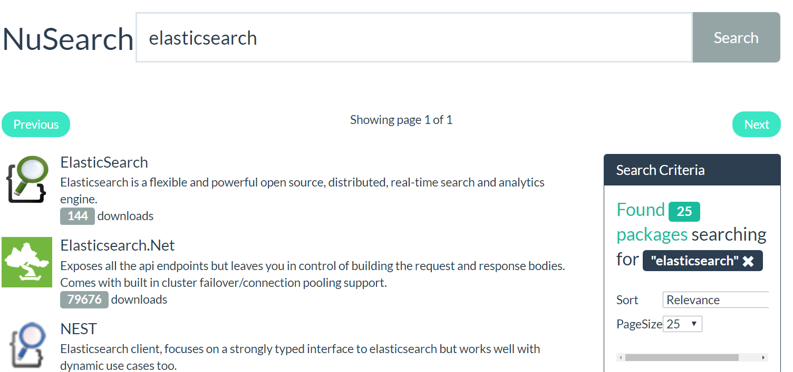

# NuSearch

A tutorial repository that helps you get started with Elasticsearch through NEST (the official elasticsearch .NET client). 

## Elasticsearch 5.x

To follow the tutorial for the latest stable Elasticsearch version (5.x) use the [5.x branch](https://github.com/elastic/elasticsearch-net-example/tree/5.x)

Or if you need to cheat/peek at the final solution checkout [5.x-codecomplete](https://github.com/elastic/elasticsearch-net-example/tree/5.x-codecomplete)

## Elasticsearch 2.x

To follow the tutorial for the latest stable Elasticsearch version (2.x) use the [2.x branch](https://github.com/elastic/elasticsearch-net-example/tree/2.x)

Or if you need to cheat/peek at the final solution checkout [2.x-codecomplete](https://github.com/elastic/elasticsearch-net-example/tree/2.x-codecomplete)

