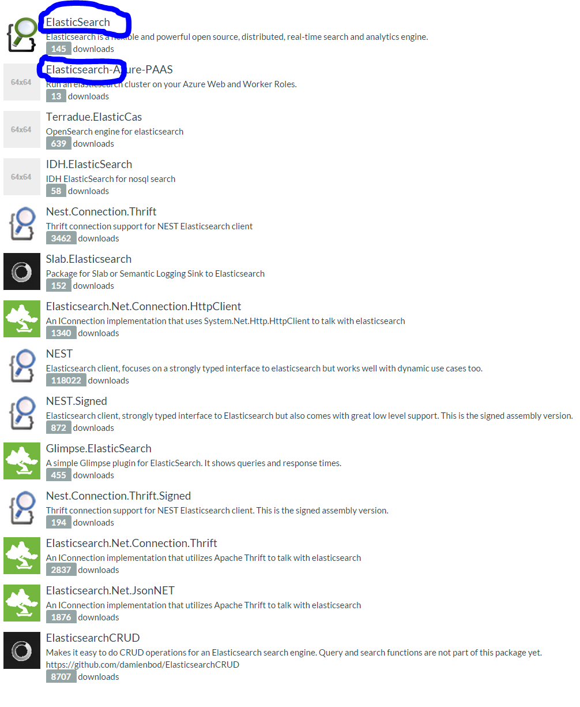
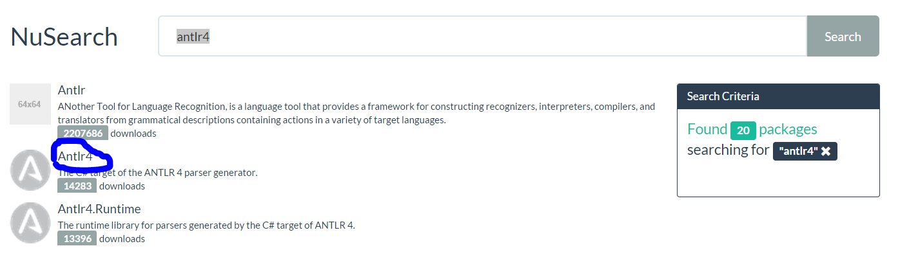

# NuSearch

## NOTE !

If you are reading this on a fork note that it may be out of sync with: https://github.com/elastic/elasticsearch-net-example

We are still working on the final section and part 1 needs more explaining but you can follow this example along now if you wish!

The solution works in both visual studio and xamarin studio so feel free to play around with either. 

The idea is to release this tutorial in a more official format once we release NEST 2.0 and we might squash and rebase all our branches in the future.


# Part 1: Installing
 - Downloading Elasticsearch and configure
 - Install marvel and head
 - Extract NuGet feed data

# Part 2: Indexing

### Naive indexing approach and some NEST basics

Before we can begin searching for packages we need to index them into Elasticsearch.

Let's take a look at `NuSearch.Indexer`, this is the console application that will be responsible for reading in the package data from the NuGet feed files and indexing them into ES.

In `Main()` we have the following code:

```csharp
private static ElasticClient Client { get; set; }

private static NugetDumpReader DumpReader { get; set; }

static void Main(string[] args)
{
	Client = NuSearchConfiguration.GetClient();
	DumpReader = new NugetDumpReader(@"C:\NugetData");

	IndexDumps();

	Console.Read();
}
```

Before we start, there are a few classes in the above snippet that we need to gain an understanding of.  `ElasticClient` is the entry point into NEST and is the class that is responsible for making requests to all of the Elasticsearch APIs such as indexing and searching, as well as administrative APIs like snapshot/restore, cluster and node stats, etc.  `ElasticClient` is thread-safe; you can create a singleton instance and keep it around in your application, or you can instantiate a new instance for every request.

`NuSearchConfiguration` is a class specific to this workshop, and holds all of the application specific configuration for our `NuSearch` Elasticsearch cluster.  This centralized configuration is handy since later we'll be building out our web application and we'll want to use the same settings to talk to Elasticsearch.

Let's take a closer look at `NuSearchConfiguration.GetClient()` method:

```csharp
static NuSearchConfiguration()
{
	_connectionSettings = new ConnectionSettings(CreateUri(9200));
}

public static ElasticClient GetClient()
{
	return new ElasticClient(_connectionSettings);
}
```

We're not doing anything special here (yet).  Just simply returning a new instance of `ElasticClient` that takes a `ConnectionSettings` object with all of the default values.

Lastly, `NugetDumpReader` is another workshop specific class that we put together for your convenience that simply reads each the NuGet feed file into a `NugetDump` POCO.  `NugetDump` contains a single `IEnumerable<FeedPackage>` property `Dumps` which holds a collection of packages, each represented as a `FeedPackage`, an unmodified representation of a package directly from the NuGet API.  We create a new instance of `NugetDumpReader` and tell it where the nuget dump files live by passing the path to the files in the constructor.

Now that we're all acquainted with the various classes in our indexer, let's get to the interesting bits and start getting data into Elasticsearch!

First, we'll take the simplest approach and just iterate over each `FeedPackage` in a single dump file and index them individually into an index that we'll named `nusearch`.  We can do this by using the `ElasticClient.Index()` method:

```csharp
var packages = DumpReader.Dumps.Take(1).First().NugetPackages;

foreach (var package in packages)
{
	var result = Client.Index(package);

	if (!result.IsValid)
	{
		Console.WriteLine(result.ConnectionStatus.OriginalException.Message);
		Console.Read();
		Environment.Exit(1);
	}
	Console.WriteLine("Done.");
}

```

*NOTE: We did a `.Take(1)` on the dump files, meaning we are only reading a single file, simply to save us time by not indexing everything just yet since we are going to refine our indexing code a few times over.*

The `Index()` method accepts two parameters, (1) the required object (document) to index and (2) an optional lambda expression which enables us to further define the index request (more on that later).

`Index()` returns an `IIndexResponse` (assigned to `result`) which holds all of the relevant response information returned by Elasticsearch.  `IIndexResponse` as well as all response objects in NEST implement `IResponse`, and `IResponse` contains a boolean `IsValid` property that tells us whether or not the request succeeded.

`IResponse` also contains a `ConnectionStatus` object which holds all of the details of the request such as the original raw JSON that was sent, the request URL, the exception from ES (if the request failed), as well as other metrics.  We'll touch more on this later in the workshop.

Let's run the application and see what we get...

You should have gotten an `ArgumentNullException`: `Value cannot be null. Parameter name: index`

What happened here?  Notice in our application, we never specified which index to index our packages into, which the API requires.  We can specify the index in several ways using NEST, but for now let's just set a default index for the entire client using our connection settings:

```csharp
static NuSearchConfiguration()
{
	_connectionSettings = new ConnectionSettings(CreateUri(9200))
		.SetDefaultIndex("nusearch");
}
```

If we run our indexer again, after a few seconds, only `Done.` should be written to the console meaning all of our index requests were successful.

We can check the results using Sense by executing a simple match all query against our `nusearch` index (i.e. the SQL equivalent of `SELECT TOP 10 * FROM nusearch` and see what we have:

**GET /nusearch/_search**
```json
{
  "query": {
    "match_all": {}
  }
}
```

You should get back a response similar to the following:

```json
{
   "took": 2,
   "timed_out": false,
   "_shards": {
      "total": 5,
      "successful": 5,
      "failed": 0
   },
   "hits": {
      "total": 934,
      "max_score": 1,
      "hits": [
         {
            "_index": "nusearch",
            "_type": "feedpackage",
            "_id": "01d60cc9-6e4d-4119-93d3-9634180b8e87",
            "_score": 1,
            "_source": {
               "id": "01d60cc9-6e4d-4119-93d3-9634180b8e87",
               "version": "3.0.0.0",
               "authors": "shidengyun",
               "copyright": "Copyright 2014",
               "created": "2014-03-20T03:45:20.017",
               "dependencies": "Castle.Core:3.2.2:",
               "description": "test",
               "downloadCount": 1463,
               "galleryDetailsUrl": "https://www.nuget.org/packages/01d60cc9-6e4d-4119-93d3-9634180b8e87/3.0.0",
               "iconUrl": "http://www.shidengyun.com/",
               "isLatestVersion": true,
               "isAbsoluteLatestVersion": true,
               "isPreRelease": false,
               "lastUpdated": "2015-03-30T03:49:20Z",
               "published": "2014-03-20T03:45:20.017",
               "packageHash": "tbPue2jiphoNWvYSricpeCg7E/+4Cmw/JJNwrgaxFnvENHIEsh9QhWVLkS8J68hKD93YrDJvcTR39j58cVrblw==",
               "packageHashAlgorithm": "SHA512",
               "packageSize": 4359,
               "reportAbuseUrl": "https://www.nuget.org/package/ReportAbuse/01d60cc9-6e4d-4119-93d3-9634180b8e87/3.0.0",
               "requireLicenseAcceptance": false,
               "tags": "test",
               "title": "DaxnetNugetTest",
               "versionDownloadCount": 950,
               "lastEdited": "0001-01-01T00:00:00",
               "licenseUrl": "http://www.shidengyun.com/"
            }
         },
         {
         	...
```

W00t!  We have documents.

A few things to note here by looking at the meta data of one of the returned hits.  `_index` tells us what index the document belongs to and this case it's `nusearch` as expected since that's what we set our default index to.  However, the keen observer will have noticed that we never specified a type and yet `_type` here is `feedpackage`...how did that happen?

Since we did not explicitly set a type NEST automatically inferred the type `feedpackage` from the C# type name.

Also, we did not specify an ID, but notice that `_id` is set to the same value present in our `id` property (the NuGet package ID).  NEST was also smart enough to infer the ID by convention, looking for an `Id` property.

Let's change the type name here to just `package` instead.  We could do this explicitly in the index request itself:

```csharp
var result = Client.Index(package, i => i
	.Type("package")
);
```

Which could be useful, but we'd have to remember to always specify the type when ES requires it.  Most of the time you just want a specific POCO to map to a specific ES type, so let's tell NEST to always use the ES type `package` when dealing with a `FeedPackage`:

```csharp
static NuSearchConfiguration()
{
	_connectionSettings = new ConnectionSettings(CreateUri(9200))
		.SetDefaultIndex("nusearch")
		.MapDefaultTypeNames(m => m
			.Add(typeof(FeedPackage), "package")
		);
}
```

While we're here, let's take this a step further and instead of setting a default index, let's tell NEST to always route requests to the `nusearch` index when dealing with a `FeedPackage`:

```csharp
static NuSearchConfiguration()
{
	_connectionSettings = new ConnectionSettings(CreateUri(9200))
		.SetDefaultIndex("nusearch")
		.MapDefaultTypeNames(m => m
			.Add(typeof(FeedPackage), "package")
		)
		.MapDefaultTypeIndices(m => m
			.Add(typeof(FeedPackage), "nusearch")
		);
}
```

Now we can reindex our packages again using our new settings, but first we'll need to delete the existing index.  Let's add the following to our indexing code:

```csharp
static void DeleteIndexIfExists()
{
	if (Client.IndexExists("nusearch").Exists)
		Client.DeleteIndex("nusearch");
}

static void Main(string[] args)
{
	Client = NuSearchConfiguration.GetClient();
	DumpReader = new NugetDumpReader(@"C:\NugetData")

	DeleteIndexIfExists();
	IndexDumps();

	Console.Read();
}
```

Checking our results in Sense again, our hits meta data should now look like this:

```json
"_index": "nusearch",
"_type": "package",
"_id": "01d60cc9-6e4d-4119-93d3-9634180b8e87",
"_score": 1,
```

### Bulk indexing

Right now our indexer iterates over a dump file and indexes each package one at a time.  This means we're making a single HTTP request for every package!  That may be fine for indexing a few packages here and there, but when we have a large amount of documents, an HTTP request per document is going to add a lot of network overhead.

Instead, we're going to use [Elasticsearch's Bulk API](http://www.elastic.co/guide/en/elasticsearch/reference/current/docs-bulk.html) which will enable us to index multiple documents in a single HTTP request, and in turn give us better performance.

Let's change up our indexing code and use the `Bulk()` method exposed by NEST:

```csharp
static void IndexDumps()
{
	var packages = DumpReader.Dumps.Take(1).First().NugetPackages;

	var result = Client.Bulk(b =>
	{
		foreach(var package in packages)
			b.Index<FeedPackage>(i => i.Document(package));

		return b;
	});

	if (!result.IsValid)
	{
		Console.WriteLine(result.ConnectionStatus.OriginalException.Message);
		Console.Read();
		Environment.Exit(1);
	}

	Console.WriteLine("Done.");
}
```

Here we are using a multi-line lambda within the `Bulk()` call to iterate over our `packages` collection, and passing each object to the bulk `Index()` method.  Notice here, different from the regular `Client.Index()` method, we had to explicitly state the type of the object we are indexing.  This is because `Bulk()` can deal with more than one different type in the same request.  We could easily have a `b.Index<Foo>(i => i.Document(myFoo))` in the same `foreach` loop.  In fact, the bulk API also supports different operations (delete and update) in the same bulk call as well.  So we could also have a `b.Delete<FeedPackage>(d => d.Id(123))` in our call too.

Let's take a look at the request that `Bulk()` generates.  It is going to build up a JSON payload that the bulk API expects, that is the operation to perform (in our case all `index`) followed by the document to index on the next line:

```json
{ "index" :  {"_index":"nusearch","_type":"package","_id":"NEST"} }
{"id":"NEST","version":"1.4.3.0","authors":"Elasticsearch, Inc." }
{ "index" :  {"_index":"nusearch","_type":"package","_id":"Elasticsearch.Net"} }
{"id":"nest","version":"1.4.3.0","authors":"Elasticsearch, Inc." }
{ "index" :  {"_index":"nusearch","_type":"package","_id":"Newtonsoft.Json"} }
{"id":"Newtonsoft.Json","version":"1.4.3.0","authors":"James K. Newton" }
```

The corresponding response from the bulk API will be a collection of results where each item pertains to the status of the corresponding bulk operation.  For our example above, the response would look like:

```json
"items": [
	{"index":{"_index":"nusearch","_type":"package","_id":"NEST","_version":1,"status":201}},
	{"index":{"_index":"nusearch","_type":"package","_id":"Elasticsearch.NET","_version":1,"status":201}},
	{"index":{"_index":"nusearch","_type":"package","_id":"Newtonsoft.Json","_version":1,"status":201}}
]
```

The `201 CREATED` status signifying that each bulk operation completed successfully.

Know that a single failing operation in the bulk call will not fail the entire request.  For instance, if the `NEST` document above failed 
to index for some reason, but the other two documents succeeded, the HTTP status code for the entire request would still be a `200 OK`, 
but the corresponding object in the `items` for `NEST` would indicate a failure through the `status` property, likely to be in the `400` or `500` range.

However in `NEST` the `.IsValid` property will only be true if all the individual items succeeded regardless of the actual HTTP status code.

Let's go back to our `IndexDumps()` method and revist our bulk code.  

`BulkResponse` exposes an `ItemsWithErrors` collection which will contain any bulk operation that failed.

Let's modify `IndexDumps()` again and check the response for errors by adding the following:

```csharp
if (!result.IsValid)
{
	foreach (var item in result.ItemsWithErrors)
		Console.WriteLine("Failed to index document {0}: {1}", item.Id, item.Error);
}
```

Let's go ahead and run our indexer again.

All should be well and once again, only `Done.` should be written in the console.  We've just bulk indexed our packages!

### A shortcut to bulk indexing

One of the design goals in NEST is to always maintain a strict 1-to-1 mapping with the Elasticsearch API.  Only then do we think about extending the client and exposing more convenient ways of accomplishing common uses cases.

For instance, often times the bulk API is used simply to just index a bunch of documents in one go.  Our current indexing code may seem a bit too verbose for such a simple operation, however NEST doesn't stop you from being explicit with the bulk API if you so desire.

On the other hand, for our case (and also the common case) where we are just indexing documents of the same type, wouldn't it be nice to instead just pass a collection of objects to a method rather than iterating over each one individually?

Well, you can do just that using the `IndexMany()` method, a NEST abstraction over the bulk API which simply takes a collection of objects and expands to our current bulk indexing implementation.

Let's simplify our code a bit using `IndexMany()` instead:

```csharp
static void IndexDumps()
{
	var packages = DumpReader.Dumps.Take(1).First().NugetPackages;

	var result = Client.Bulk(b => b.IndexMany(packages));

	if (!result.IsValid)
	{
		foreach (var item in result.ItemsWithErrors)
			Console.WriteLine("Failed to index document {0}: {1}", item.Id, item.Error);

		Console.WriteLine(result.ConnectionStatus.OriginalException.Message);
		Console.Read();
		Environment.Exit(1);
	}

	Console.WriteLine("Done.");
}
```

Much better, wouldn't you say? :)

### A shortcut to the shortcut

We can even cut another corner here.  `.Bulk(b => b.IndexMany(packages))` is useful if we plan on also performing other bulk operations such as updates or deletes in the same request.  However, if we are only interested in indexing then we can simplify this even further by using the `IndexMany()` that is exposed directly on `ElasticClient`:


```csharp
static void IndexDumps()
{
	var packages = DumpReader.Dumps.Take(1).First().NugetPackages;

	var result = Client.IndexMany(packages);

	if (!result.IsValid)
	{
		foreach (var item in result.ItemsWithErrors)
			Console.WriteLine("Failed to index document {0}: {1}", item.Id, item.Error);

		Console.WriteLine(result.ConnectionStatus.OriginalException.Message);
		Console.Read();
		Environment.Exit(1);
	}

	Console.WriteLine("Done.");
}
```

This is still functionally equivalent to our previous approaches and simply calls into the bulk API, but much more convenient.

### Mappings and document relations

Now that we've bulk indexed our packages, let's take a step back and query for all of our indexes packages using Sense by issuing a `GET /nusearch/_search`:

```json
{
   "took": 4,
   "timed_out": false,
   "_shards": {
      "total": 5,
      "successful": 5,
      "failed": 0
  },
   "hits": {
      "total": 934,
      "max_score": 1,
      "hits": [...]
   }
}
```

Something funny is going on here.  If you've noticed, our dump file contained `5000` packages, but our hits total is only `934`.  Where are the missing packages?

The reason for this is due to the fact that our NuGet data contains multiple versions of the same package (i.e. NEST 1.0, NEST 1.1, etc...) and each package share the same `Id`.  When Elasticsearch encounters an existing `Id` when indexing, it treats it as an update and overwrites the existing document with the new data.

This is probably useful for many use cases, but for ours, we may want to be able to search for specific versions of a package, or at least view them.  To accomplish this, we are going to have to restructure our models and the way we store them in Elasticsearch by creating a more domain-specific mapping.

As mentioned earlier, our current `FeedPackage` class is an unmodified representation of a package from the NuGet feed.  Instead, let's create our own models that our structured more appropriately for our search application.

What we want instead is a nested structure, where we have a single top-level package that contains the common/shared information and within it a collection of versions.  We also want to be able to query for a specific version and still return the top-level package.  Elasticsearch will gladly deal with complex object graphs, and has a special [nested type](http://www.elastic.co/guide/en/elasticsearch/reference/current/mapping-nested-type.html) specifically for dealing with such relationships.

Before we set this up in Elasticsearch, let's first restructure our `FeedPackage`.

For convenience and for sake of time, this has already been done.  In our `Domain` project, under the `Model` namespace, we have a few classes that we'll just need to include in the project:

 - `Package.cs`
 - `PackageVersion.cs`
 - `PackageAuthor.cs`
 - `PackageDependency.cs`

`Package` is our top-level representation of a NuGet package and contains all of the common information that is shared across multiple versions of a single package.  Within the `Package` class there is a `PackageVersion` collection, `Versions`, and a `PackageAuthor` collection, `Authors`.

`PackageVersion` contains all of the version specific data for a given package, and within it a `PackageDependency` collection, `Dependencies`.

`PackageAuthor` simply contains a single `Name` property, the publishing author of the package.

And lastly, `PackageDependency` contains dependency information for a given package: the assembly name, version, and supported framework.

Once we've included these new classes in our `Domain` project, the first thing we need to change is the type name and index name mappings on our connection settings to use the new `Package` type (instead of `FeedPackage`):

```csharp
static NuSearchConfiguration()
{
	_connectionSettings = new ConnectionSettings(CreateUri(9200))
		 .MapDefaultTypeNames(m => m
			.Add(typeof(Package), "package")
		)
		.MapDefaultTypeIndices(m => m
			.Add(typeof(Package), "nusearch")
		);
}
```

Next, we need to create a mapping in Elasticsearch for our `package` type in order to tell Elasticsearch to treat our version, author, and dependecny types as nested.

Prior to this, we didn't have to setup a mapping.  In fact, we didn't even have to create the index beforehand.  We were able to use the "schema-less" nature of Elasticsearch by just indexing documents and letting Elasticsearch create our `nusearch` index on the fly and determine the types of our properties automagically.  This is known as a `dynamic mapping` and is very convenient for getting off the ground but almost never suitable when you to start searching your data in specific ways.

Let's change up our indexing code a bit and create our index upfront before we actually start indexing.  We can also setup our mapping at the time we create our index.

Let's add a `CreateIndex()` with the following implementation:

```csharp
static void CreateIndex()
{

	Client.CreateIndex("nusearch", i=>i
		.NumberOfShards(2)
		.NumberOfReplicas(0)
		.AddMapping<Package>(m => m
			.MapFromAttributes()
			.Properties(ps => ps
				.NestedObject<PackageVersion>(n => n
					.Name(p => p.Versions.First())
					.MapFromAttributes()
					.Properties(pps => pps
						.NestedObject<PackageDependency>(nn => nn
							.Name(pv => pv.Dependencies.First())
							.MapFromAttributes()
						)
					)
				)
				.NestedObject<PackageAuthor>(n => n
					.Name(p => p.Authors.First())
					.MapFromAttributes()
				)
			)
		)
	);
}
```

So let's break down what we're doing here in the `CreateIndex()` call.  First, we're telling Elasticsearch to create an index named `nusearch` with 2 primary shards and no replicas.  Before this, when we weren't creating the index explicitly and just indexing documents, Elasticsearch automatically created the `nusearch` index with 5 primary shards and 1 replica, by default.

Next, `AddMapping()` allows us to define a mapping for our `Package` POCO.  First we call `MapFromAttributes()` which tells NEST to automatically map all of the public properties found in `Package` and figure out their ES type based on their C# type.  Also, if we had defined an `ElasticType` attribute (something we don't discuss in this workshop) on any of the properties, they would get picked up here.  But instead of using attributes, we are going to define our properties fluently using `Properties()`.

`Properties()` allows us to override the defaults set by `MapFromAttributes()`.  For instance, our `PackageVersion` collection by default would just be treated as an `object`, but instead we want it to be `nested` so we call `NestedObject<T>()` with `T` being `PackageVersion`.  We then supply a name, and map its properties as well by making another call to `MapFromPropertis()`.  This process is also repeated for `PackageDependency` which is nested within `PackageVersion`...two levels of nested objects!  And lastly, `PackageAuthor`.

Still with us?  Alright, now that we have our mapping setup, let's reindex our packages.  But wait, `NugetDumpReader.Dumps` just returns a collection of `FeedPackage`s, how do we go from from `FeedPackage` to our new types?  More importantly, as we iterate through the dump files, we need a way of determining when we've encountered a package for the first time in order to treat all subsequent encounters of the same package as just another version that we can include in the "main" package.

Now we just need to make a small change to `IndexDumps()` and have it call `GetPackages()` instead of reading from `Dumps` directly by changing line 1 to:

`GetPackages()` creates a dictionary of packages keyed by their ID and iterates through each package in the dump file(s).  When it encounters a new package it simply adds it to the dictionary.  When it encounters a package that already exists in the dictionary, then it simply adds the package to the `Versions` collection of the package that already exists in the dictionary.  At the end, it simply returns all of the packages as a single collection of `Package`s.  Also, take note that all of the property mapping and parsing between `FeedPackage`, `Package`, and `PackageVersion` takes place in the constructors of `Package` and `PackageVersion`.

Also, we don't want to bulk index all of our data in one request, since it's nearly 700mb.  The magic number is usually around 1000 for any data, so let's use the handy `Partition()` extension method to break up our packages into collections of 1000 documents.

Furthermore, since we're going to be reindexing a few more times...let's do another `.Take(1)` and only index a 1000 documents for now.

```csharp
static void IndexDumps()
{
	var packages = DumpReader.GetPackages();
	var partitions = packages.Partition(1000).Take(1);

	foreach (var partition in partitions)
	{
		var result = Client.IndexMany(partition);

		if (!result.IsValid)
		{
			foreach (var item in result.ItemsWithErrors)
				Console.WriteLine("Failed to index document {0}: {1}", item.Id, item.Error);
			Console.WriteLine(result.ConnectionStatus.OriginalException.Message);
			Console.Read();
			Environment.Exit(1);
		}
	}
	Console.WriteLine("Done.");
}
```

Also by doing this, we've removed the `Take(1)` that we had in earlier.  We are now going to index **all** of our dump files.

Finally, let's add a call to `CreateIndex()` before `IndexDumps()`.

`Main()` should now look like:

```csharp
static void Main(string[] args)
{
	Client = NuSearchConfiguration.GetClient();
	DumpReader = new NugetDumpReader(args[0]);

	DeleteIndexIfExists();
	CreateIndex();
	IndexDumps();

	Console.Read();
}
```

Let's run our indexer one more time- this time indexing everything!

### Aliases

Up until this point, you might have noticed that everytime we made a change to our index that required us to reindex our packages, we had to delete the existing index.  That doesn't sound ideal in a production environment.  Certainly deleting an index on a live application is not going to fly...

Elasticsearch has an awesome, and very important feature that can be leveraged to deal with situations like this: [index aliases](http://www.elastic.co/guide/en/elasticsearch/reference/current/indices-aliases.html).

> The index aliases API allow to alias an index with a name, with all APIs automatically converting the alias name to the actual index name. An alias can also be mapped to more than one index, and when specifying it, the alias will automatically expand to the aliases indices. An alias can also be associated with a filter that will automatically be applied when searching.

For the folks with a SQL background, you can sort of think of an alias as a view in SQL.

So going back to our original problem of reindexing on a live index, how can aliases help here?  Well, instead of pointing directly to the `nusearch` index in our application, we can create an alias that *points* to our index and have our application point to the alias.  When we need to reindex data, we can create a new index along side our live one and reindex our data there.  When we're done indexing, we can swap the alias to point to our newly created index- all without having the change our application code.  The operation of swapping aliases is atomic, so the application will not incur any downtime in the process.

This may be better understood through the following illustration:


So let's go ahead and implement something close to the above diagram.  First let's create a new property to hold our *actual* index name:

```csharp
private static string IndexName { get; set; }
```

We've already got a handy `CreateIndexName()` method in our `NuSearchConfiguration` class that will create us a `nusearch-` index with the current date and time appended to it.

```csharp
IndexName = NuSearchConfiguration.CreateIndexName();
```

Next, we're going to introduce 2 aliases: `nusearch`, which will point to our *live* index, and `nusearch-old` which will point to our old indices.

Now, since we've already been indexing to an actual index named `nusearch`- we're going to have to start from scratch just this initial go since you can't have an index and an alias with the same name.  So, let's delete our `nusearch` index first, using Sense: `DELETE /nusearch`.

OK, now let's actually implement some code to handle our alias swapping:

```csharp
private static void SwapAlias()
{
	var indexExists = Client.IndexExists(NuSearchConfiguration.LiveIndexAlias).Exists;

	Client.Alias(aliases =>
	{
		if (indexExists)
			aliases.Add(a => a.Alias(NuSearchConfiguration.OldIndexAlias).Index(NuSearchConfiguration.LiveIndexAlias));

		return aliases
		.Remove(a => a.Alias(NuSearchConfiguration.LiveIndexAlias).Index("*"))
		.Add(a => a.Alias(NuSearchConfiguration.LiveIndexAlias).Index(IndexName));
	});

	var oldIndices = Client.GetIndicesPointingToAlias(NuSearchConfiguration.OldIndexAlias)
	.OrderByDescending(name => name)
	.Skip(2);

	foreach (var oldIndex in oldIndices)
		Client.DeleteIndex(oldIndex);
}
```
A few more things we need to tidy up before running our indexer again...

We need to edit `CreateIndex()` to use our new `IndexName`:

```csharp
Client.CreateIndex(IndexName, i => i
	// ...
)
```

Easy enough.

Lastly, we need to change our bulk indexing call to explictly index to `IndexName`, otherwise it will infer `nusearch` from our connection settings- and that's now our alias!

```csharp
var result = Client.IndexMany(partition, IndexName);
```

We can also now get rid of that `DeleteIndexIfExists()` method since we wont be needing it anymore.

Alright, now we're all set!  We can now reindex as many times as we'd like without affecting our live web application.

# Part 3: Searching

### Web architecture

The NuSearch solution ships with a ready made `NuSearch.Web` application which is in fact a console application
that does the actual hosting of the website that we are going to be building. 

This might be a strange construct, but it allows you to focus on building the web site without having to configure IIS
or figure out how to run this on other OS's. 

The web project utilizes [OWIN]() using the excellent [NOWIN]() cross platform website and it hooks up 
[Nancy Web Framwork](), and we've gotten all the plumbing out of the way.

You are free of course to use whatever architecture in your own application. Just know that at the time 
of writing this, `NEST 1.x` does not yet work on the `.NET Core Framework` 
which at time of writing has not been released yet. Please note that support for the 
`.NET Core Framework` is a blocker for the `NEST 2.0` release.

Also please note that prior knowledge of any of these is not required to follow along!

You can start the web application simply by setting the project as start up application and pressing `F5`

You can then [goto the nusearch web application](http://localhost:8080)

If all is well you should now see this:


### Getting started

As mentioned we've already done most of the plumbing for this web application, so let's talk about what is already in place.

 Folder   | Purpose
----------|-----------
Plumbing  | Everything related to get Nancy, Owin, Nowin happy.
Search    | The folder where you are going to be writing your code.
Static    | The JavaScript and CSS for the application.  You'll need to uncomment a thing or two as we progress.

Our plumbing allows you to edit `cshtml`, `css` and `js` files while the application is running.

### The search module

Our search interface is handled by one `route` defined in the `SearchModule` class

```
public class SearchModule : NancyModule
{
	public SearchModule()
	{
		Get["/"] = x =>
		{
			var form = this.Bind<SearchForm>();
			var model = new SearchViewModel();

			// You'll be writing most of your code here

			return View[model];
		};
	}
}
```

`SearchForm` describes the parameters we are going to be sending to control our search from the user interface.
`SearchViewModel` is the model used to build the search results.

### Let's search!

Okay, enough jibber jabber, let's write some code!

In order to search we first need to get a hold of a client in our `GET` handler in the `SearchModule`.

```csharp
	var client = NuSearchConfiguration.GetClient();
```

We then issue a search for all our packages using our `client`

```csharp 
	var result = client.Search<Package>(s => s);
```

NEST uses a fluent lambda syntax which you can see in use here (`s => s`). 
What's going on here? You are describing a function here that recieves a `SearchDescriptor<Package>()`
named `s` which you can then modify to alter its state in a fluent fashion. 

This begs the question: **Why??**. Well this fluent lambda syntax takes out the cognitive overload of instantation
deeply nested generic classes and makes the DSL really terse. This is the preferred way of using the DSL but please
know **it's not the only way**. You could equally write:

```csharp
	var result = client.Search<Package>(new SearchRequest());
```

We call this syntax the `Object Initializer Syntax` and this is fully supported throughout the client. In this tutorial however
we will be using the `Fluent Lambda Syntax` exclusively.

Ok, so back to our search code so far:

```csharp 
	var result = client.Search<Package>(s => s);
```

This will do a `POST` on `/nusearch/package/_search` with the following JSON:

```json
{}
```

What this allows us to do is to pass the documents we've received from elasticsearch to our viewmodel.
We'll also inform our viewmodel how many total results `Elasticsearch` found. We didn't actually specify how many 
items we wanted to be returned in our search so `Elasticsearch` will return `10` by default. However 
`result.Total` will actually return how many documents matched our search. In this case all of our packages.

```csharp
	model.Packages = result.Documents;
	model.Total = result.Total;
```

We are also going to pass the user input `form` to the viewmodel so it knows what was requested:

```csharp
	model.Form = form;
```

If we now run our application, lo and behold we have some data!


If we crack open our `Search.cshtml`, we have two templates for when we do and when we do not have any results:

```csharp
@if (Model.Total > 0)
{
	@Html.Partial("Partials/Results", Model)
}
else
{
	@Html.Partial("Partials/NoResults", Model)
}
	
```

Later on we'll spend more time inside the `Results.cshtml` partial. As a final exercise instead of relying on the default `10` items.

Lets explicitly ask for `25` items. 

```csharp
	var result = client.Search<Package>(s => s
		.Size(25)
	);
```

Here we start to see the `Fluent Lambda Syntax` in action.

### Implementing a query

So at this point we are effectively doing `match_all` query and selecting the top 10 results.
Searching for something in the search box does not do anything.

If you type a search notice how you are submitting a form but instead of using `POST` this form uses `GET`.

This causes the entered query to be part of the url we go to after the post.


In our `SearchModule` this line of code is responsible to model bind whatever is passed on the query string 
to an instance `SearchForm` class.

```csharp
	var form = this.Bind<SearchForm>();
```

So we can use `form.Query` to access whatever the user typed in the search box.

Let's feed this to our search:

```csharp
var result = client.Search<Package>(s => s
	.Size(25)
	.Query(q=>q
		.QueryString(qs=>qs
			.Query(form.Query)
		)
	)
);
```

*wowzers*, the complexity of this method increased rapidly.  Whats going on here? 

NEST is a one-to-one mapping to the Elasticsearch API, to do a [query_string_query]() in `Elasticsearch` you have to send the following `JSON`

```json
{
  "query": {
    "query_string": {
      "query": "hello"
    }
  }
}
```

As you can see the `NEST` DSL follows this verbatim. Its important to keep in mind that NEST is not in the business of abstracting the Elasticsearch API.  In the cases where a shortcut exists, its never at the cost of **not** exposing the longer notation.

At this point I would like to clue you in on a handy trick if you are following this tutorial on a Windows machine. If [fiddler]() is
installed and running, the plumbing of this application automatically uses it as proxy. **NOTE** fiddler has to be running before you start `NuSearch.Web`.


If you want to always see pretty responses from Elasticsearch, update `NuSearchConfiguration.cs` and add `.UsePrettyResponses()`
to the `ConnectionSettings()`

### Exploring querying further

So right now we have a fully working search, but how does elasticsearch know what fields to search?  Well by default, Elasticsearch cheats a little.

All the values of all the fields are **also** aggregated into the index under the special [_all]() field.

If you do not specify a field name explicitly, then queries that allow you to not specify a field name will default to that `_all` field.

Another thing to note about the [query_string_query]() we've used is that it exposes the Lucene query syntax to the user. 

Try some of the following queries in NuSearch:

* `id:hello*`
* `id:hello* OR id:autofac^1000`

Whats going on here?  Well in the first query we explicitly search for only those `Package`'s who's `id` start with `hello`.  In the second example we extend this query to also include `autofac` but boost it with a factor `1000` so that its first in the result set.

Do you want to expose this to the end user? Consider the following:

* `downloadCount:10`

This will search all the packages with a download count of `10` pretty straight forward.

However, If we search for:

* `downloadCount:X`

then we get no results. This makes sense, but Elasticsearch is actually throwing an exception in this case:

```json
{
  "error" : "SearchPhaseExecutionException[Failed to execute phase [query], ..."
  "status" : 400
}
```

If you remember my fiddler tip earlier, if you run it you can whitness this for yourself.

Elasticsearch has a *better* `query_string_query` called 
[simple_query_string_query](http://www.elastic.co/guide/en/elasticsearch/reference/master/query-dsl-simple-query-string-query.html) which will never throw an exception and ignores invalid parts.

Yet the question remains, do you want to expose this power to the end user? Quite often the answer is NO. 

### The (multi)_match query

The match query family is a very powerful one. It will *do the right thing* TM based on what field its targeting.

Let's use the [multi_match]() query to apply our search term(s) to several fields we actually want to participate in the search:

```csharp
.Query(q => q
	.MultiMatch(m => m
		.OnFields(p => p.Id, p => p.Summary)
		.Query(form.Query)
	)
)
```

Now we are searching through `id` and `summary` fields only, instead of the special `_all` field.  Lets look at results:


It almost looks as if matches on `id` are more important then those on `summary`, but as the highlighted result demonstrates, something else is actually going on...

By default `Elasticsearch` uses [TF/IDF](http://www.tfidf.com/) for relevancy scoring.

TF(t) = (Number of times term t appears in a document) / (Total number of terms in the document).

IDF(t) = log_e(Total number of documents / Number of documents with term t in it).

This scoring mechanism favors hits on rarer terms in the index, and hits in shorter fields outweigh hits in longer fields. 

More concretely a hit for `elasticsearch` in `id` is usually scored higher then a hit in `summary` since in most cases `id` is a field with less terms over all.

If we had searched `elasticsearch client` the `elasticsearch` keyword would be higher because its IDF is higher than `client` because the 
entire index contains the term `client` more than it does `elasticsearch`.

This explains why the highlighted packages `Nest.Connection.Thrift` and `Terradue.ElasticCas` score higher than some of the other packages with `elasticsearch` in the id.They have very short `summary` fields. `Nest` and `Nest.Signed` both mention `elasticsearch` in the `summary` and therefore score higher than `Glimpse.Elasticsearch`

**NOTE:**
In closing I have to note that relevancy scoring is a complex and well researched problem in the information retrieval space. Our explanation of how Elasticsearch handles relevancy is a tad simplified.  If you are interested in learning more of [the theory behing scoring](http://www.elastic.co/guide/en/elasticsearch/guide/master/scoring-theory.html) and how 
[Lucene takes a practical approach TD/IDF and the vector space model](http://www.elastic.co/guide/en/elasticsearch/guide/master/scoring-theory.html), the Elasticsearch guide has got you covered!.  Also know that Elasticsearch allows you to (plug in custom similarity scorers)[http://www.elastic.co/guide/en/elasticsearch/reference/1.4/index-modules-similarity.html].

### Analysis

So I have to clue you in one another fact: the only packages matching on `id` are the ones highlighted in blue:



I hear you say, "*OH NOES!*" but don't worry, this is by design. Lets zoom out a bit and look at whats happening when you index.

Lets index these two ficticiuous documents:

```json
{ 
   "id":1,
   "name": "Elasticsearch-Azure-PAAS",
   "author": {
        "name" : "garvincasimir and team",
        "country" : "Unknown",
   }
}
```

```json
{ 
   "id":2,
   "name": "Elasticsearch.Net",
   "author": {
        "name" : "Elasticsearch .NET team",
        "country" : "Netherlands",
   }
}
```
Elasticsearch will actually represent this document as an inverted index:

| field      | terms             | documents
|--------|-------------------|------------
|name      | elasticsearch     | 1
|        | azure            | 1
|        | paas              | 1
|        | elasticsearch.net    | 2
|author.name      | team     | 1,2
| `....`
 
JSON property values are fed through the index analysis pipeline, its purpose is to extract the correct terms. 

Fields can have different analyzers, but out of the box all string properties use the [standard analyzer]().

The standard analyzer tokenizes the text based on the Unicode Text Segmentation algorithm, as specified 
[in Unicode Standard Annex #29.](http://unicode.org/reports/tr29/). 

This suprisingly dictates not to split words conjoint by a dot.

The standard analyzer furthermore lowercases tokens and removes English stop words (highly common words such as `the`, `and`). 

The resulting tokens that come out of the index analysis pipeline are stored as `terms` in the inverted index.

You can easily see how the standard analyzer acts on a stream of text by calling the [Analyzer API]() in Elasticsearch:

```
http://localhost:9200/_analyze?pretty=true&analyzer=default&text=Elasticsearch.NET
```

```json
{
  "tokens" : [ {
    "token" : "elasticsearch.net",
    "start_offset" : 0,
    "end_offset" : 17,
    "type" : "<ALPHANUM>",
    "position" : 1
  } ]
}
```

```
http://localhost:9200/_analyze?pretty=true&text=Elasticsearch-Azure-PAAS
```


```json
{
  "tokens" : [ {
    "token" : "elasticsearch",
    "start_offset" : 0,
    "end_offset" : 13,
    "type" : "<ALPHANUM>",
    "position" : 1
  }, {
    "token" : "azure",
    "start_offset" : 14,
    "end_offset" : 19,
    "type" : "<ALPHANUM>",
    "position" : 2
  }, {
    "token" : "paas",
    "start_offset" : 20,
    "end_offset" : 24,
    "type" : "<ALPHANUM>",
    "position" : 3
  } ]
}
```

We can clearly see now that `Elasticsearch.NET` is **NOT** broken up but `Elasticsearch-Azure-PAAS` is.

### Query analysis

We've now shown you how Elasticsearch creates terms from your JSON property values. Another process happens at query time.   Some, but **not all** query constructs also perform analysis on the query they receive to construct the correct terms to locate.

The [multi_match]() we are using right now is one of those constructs that analyzes the query it receives.

If we search for `Elasticsearch-Azure-PAAS` the [standard]() analyzer again kicks in and Elasticsearch will actually use 
`elasticsearch`, `azure` and `paas` to locate documents in its inverted index that contain any of these terms.

The [match family of queries]() default to using `OR` on the terms.  Being inclusive or exclusive in your search results is another hot topic with no right answer. I personally find being exclusive a whole lot more useful.  For instance, when I search for `Elasticsearch-Azure-SAAS` I do not want any results that only have the terms `azure` and `saas`.

Lets update our search to use `AND` on the resulting terms we provide

```
.Query(q => q
	.MultiMatch(m => m
		.OnFields(p => p.Id, p => p.Summary)
		.Operator(Operator.And)
		.Query(form.Query)
	)
)
```

*Whoohoo!* Now when we search for `Elasticsearch-Azure-SAAS` we only get one result minus all the noise of Azure packages that have nothing
do with Elasticsearch.

Knowing how the analysis chain works both an index and at query time, can you answer the following question?:

**Will the following document surface using our multi_match query on id and summary using the query `Elasticsearch`?**

```json
{
   "id": "Microsoft.Experimental.Azure.ElasticSearch",
   "summary": "This package can deploy Elastic Search on an Azure worker node."
}
```

Yes! You are right it **WON'T!**

Obviously the `standard` analyzer is not cutting it for our data.

### Defining analyzers

Quite often the `standard` analyzer works great for regular plain English corpus's. But as we've shown it won't always work for your domain metadata. 

Ideally we would want to search on NuGet packages as followed, in order of importance

1. **Exact match**: an exact match on id should always be the first hit.
2. **Better matches of logical parts of the id**: id's should also be broken up by dots and even capitalization (e.g we want the `module` out of `ScriptCs.ShebangModule`).
3. Full text search on summary and version descriptions.

### The analysis process

Elasticsearch allows you to build your own analysis chain to find the right terms to represent a body of text. 

* [character filters] Preprocess the text before its handed of to the tokenizer, handy for e.g stripping out html prior to tokenizing.
* [tokenizer] an analysis chain can have only 1 tokenizer to cut the provided string up in to terms.
* [token filters] operate on each indivual token and unlike the name might imply these `filter` are not just able to remove terms but also replace or inject more terms.

So knowing the defaults don't cut it for our nuget id's lets set up some analysis chains when we create the index:

```csharp
.Analysis(analysis=>analysis
	.Tokenizers(tokenizers=>tokenizers
		.Add("nuget-id-tokenizer", new PatternTokenizer { Pattern = @"\W+" })
	)
	.TokenFilters(tokenfilters=>tokenfilters
		.Add("nuget-id-words", new WordDelimiterTokenFilter
		{
			SplitOnCaseChange = true,
			PreserveOriginal = true,
			SplitOnNumerics = true,
			GenerateNumberParts = false,
			GenerateWordParts = true,
		})
	)
	.Analyzers(analyzers=>analyzers
		.Add("nuget-id-analyzer", new CustomAnalyzer
		{
			Tokenizer = "nuget-id-tokenizer",
			Filter = new [] { "nuget-id-words", "lowercase" }
		})
		.Add("nuget-id-keyword", new CustomAnalyzer
		{
			Tokenizer = "keyword",
			Filter = new [] { "lowercase" }
		})
	)
)
```
Quite a lot is going on here so let's break it down a tad.


```csharp
.Analysis(analysis=>analysis
	.Tokenizers(tokenizers=>tokenizers
		.Add("nuget-id-tokenizer", new PatternTokenizer { Pattern = @"\W+" })
	)
```

Since the default tokenizer does not split `Elasticsearch.Net` into two terms as previously shown we'll register a [PatternTokenizer]() 
that splits on any non word character. We call this instance of the `PatternTokenizer` `nuget-id-tokenizer` so we can reference it later.

```csharp
.TokenFilters(tokenfilters=>tokenfilters
	.Add("nuget-id-words", new WordDelimiterTokenFilter
	{
		SplitOnCaseChange = true,
		PreserveOriginal = true,
		SplitOnNumerics = true,
		GenerateNumberParts = false,
		GenerateWordParts = true,
	})
)
```

Here we set up a [WordDelimiterTokenFilter]() which will furter cut terms if they look like two words that are conjoined.
e.g `ShebangModule` will be cut up in `Shebang` and `Module` and because we tell it to preserve the original token `ShebangModule` as a whole
is kept as well. 


Now that we've registered our custom [Tokenizer]() and [TokenFilter]() we can create a custom analyzer that will utilize these

```csharp
.Analyzers(analyzers=>analyzers
	.Add("nuget-id-analyzer", new CustomAnalyzer
	{
		Tokenizer = "nuget-id-tokenizer",
		Filter = new [] { "nuget-id-words", "lowercase" }
	})
```

Here we create an analyzer named `nuget-id-analyzer` which will split the input using our `nuget-id-tokenizer` and then filters the resulting terms
using our `nuget-id-words` filter (which will actually inject more terms) and then we use the build in `lowercase` tokenfilter which replaces all the
terms with their lowercase counterparts.

```csharp
	.Add("nuget-id-keyword", new CustomAnalyzer
	{
		Tokenizer = "keyword",
		Filter = new [] { "lowercase" }
	})
)
```

Here we create a special `nuget-id-keyword` analyzer. The built in [Keyword Tokenizer]() simply emits the text as provided as a single token. We
then use the `lowercase` filter to lowercase the nuget id as a whole. This will allow us to boost exact matches higher without the user having
to know the correct casing of the nuget id. 

Now that we have registered our custum analyzers we need to update our mapping so that the Id property uses them.

```csharp
.String(s=>s
	.Name(p=>p.Id)
	.Analyzer("nuget-id-analyzer")
	.Fields(f=>f
		.String(p=>p.Name("keyword").Analyzer("nuget-id-keyword"))
		.String(p=>p.Name("raw").Index(FieldIndexOption.NotAnalyzed))
	)
)
```

Here we setup our `Id` property as a [Multifield mapping](). This allows you to index a field once but elasticsearch will create additional fields in 
the inverted index that we can target during search later on.

At index time `id` will use our `nuget-id-analyzer` to split the id into the proper terms, but also when we do a `match` query on the `id` field
elasticsearch will also use our `nuget-id-analyzer` to generate the correct terms from the provided query.


When we query `id.keyword` using the `match` query elasticsearch will simply use the whole query and lowercase it and use that as the term to look 
for inside the inverted index for `id.keyword`

We also create a field in the inverted index called `id.raw` which is simply **not** analyzed and stored **as is**. This makes this field very well suited
to sort (remember lowercasing might change sort order in some locales) and aggregations.

Now that we have our new mapping in place make sure you reindex so that we can take advantage of our new analysis.


##Updating our search

Since we now have a [Multifield mapping]() set up for our `Id` property we differentiate between an exact lowercase match and a match in our analyzed field.
Furthermore we can make sure a match in our `Summary` field has a lower weight in the overall score of our matching document.

```csharp
.MultiMatch(m => m
	.OnFieldsWithBoost(fields=>fields
		.Add(p=>p.Id.Suffix("keyword"), 1.5)
		.Add(p=>p.Id, 1.5)
		.Add(p=>p.Summary, 0.8)
	)
	.Operator(Operator.And)
	.Query(form.Query)
)
```

Note: the `.Suffix("")` notation is a great way to reference the fields defined using a multifield mapping without fully giving up on strongly typed 
property references.

If we now search for `elasticsearch` we'll see all the packages we missed earlier, such as the afformentioned 
`Microsoft.Experimental.Azure.ElasticSearch` because of the faulty tokenization are now included!


Looking at results however we see an adverse effect in that strong boost on id will push down popular packages. In this case `NEST` is the official 
.NET client for `Elasticsearch` but because it has a clever name and only mentions elasticsearch in its summary, its penalized by being at the bottom of the search results. With well over a 100k downloads, its the most downloaded package in our results set. 

What we want to do is given a search take a given document's downloadCount into account.

```csharp
.Query(q => q
	.FunctionScore(fs => fs
		.MaxBoost(100)
		.Functions(ff => ff
			.FieldValueFactor(fvf => fvf
				.Field(p => p.DownloadCount)
				.Factor(0.0001)
			)
		)
		.Query(query => query
			.MultiMatch(m => m
				.OnFieldsWithBoost(fields => fields
					.Add(p => p.Id.Suffix("keyword"), 1.5)
					.Add(p => p.Id, 1.2)
					.Add(p => p.Summary, 0.8)
				)
				.Operator(Operator.And)
				.Query(form.Query)
			)
		)
	)
)
```

The [function score] query is the one stop query if you want to influence score beyond TD/IDF and boosting.

Here we use `field value factor` with a factor of `0.0001` over each documents downloadCount combined with its query score

This equates to: `(0.0001 * downloadCount) * score of query` . Meaning that for packages with low download counts the actual relevance score
is a major differentatior while still acting as a high signal booster for packages with high download counts.

When we now look at our results:


`NEST` and `Elasticsearch.Net` have succesfully surfaced to the top we can also see that this is not simply a sort on downloadcount because
`Elasticsearch.Net` is the number one result despite the fact it has less downloads then `NEST`. 

##Combining multiple queries

Elasticsearch exposes boolean [queries] and [filters] but these do not quite equate to the boolean logic you are use to in C#. NEST allows you
to write use `&&` `||` and `!` to combine queries into elasticsearch boolean queries but NEST will combine them in such a way that they do follow the exact same boolean logic you are use to in C#.

Having fixed surfacing popular packages for keywords, we've broken exact matches on `Id` being most important. As can be seen by doing a query for `antlr4`



```csharp
.Query(q => 
	q.Match(m=>m.OnField(p=>p.Id.Suffix("keyword")).Boost(1000).Query(form.Query))
	|| q.FunctionScore(fs => fs
		.Functions(ff => ff
			.FieldValueFactor(fvf => fvf
				.Field(p => p.DownloadCount)
	//snipp				
```

Here we use the `OR` operator `||` to create a boolean query to match either on our keyword multifield and if it does give it a ridiculous boost
or otherwise it will have to match with our functionscore query. Note that you can remove the `p.Id.Suffix` from your `MultiMatch` query now.


## Conditionless queries

The `Fluent lambda syntax` has a feature turned on by default called **conditionless queries** which will rewrite incomplete queries out of the actual query that is sent to Elasticsearch. Given that our query now looks like this:

```csharp
.Query(q => 
	q.Match(m=>m.OnField(p=>p.Id.Suffix("keyword")).Boost(1000).Query(form.Query))
	|| q.FunctionScore(fs => fs
		.Functions(ff => ff
			.FieldValueFactor(fvf => fvf
				.Field(p => p.DownloadCount)
				.Factor(0.0001)
			)
		)
		.Query(query => query
			.MultiMatch(m => m
				.OnFieldsWithBoost(fields => fields
					.Add(p => p.Id, 1.2)
					.Add(p => p.Summary, 0.8)
				)
				.Operator(Operator.And)
				.Query(form.Query)
			)
		)
	)
)
```

What happens if `form.Query` is actually `null` or `empty`? Well in that case 

1. The first match query on the left side of the `||` operator will mark itself as `conditionless`
2. The `function_score` on the right side of the operator will mark its `query` property as conditionless but because it has functions it won't actually mark itself.
3. The `||` operator handling notices there is only one resulting query (the `function_score`) and won't wrap it in an unneeded boolean query.

If you are following along with fiddler you can see that in case of an empty `form.Query` `NEST` will send the following query to elasticsearch:

```json
{
  "size": 25,
  "query": {
    "function_score": {
      "functions": [
        {
          "field_value_factor": {
            "field": "downloadCount",
            "factor": 0.0001
          }
        }
      ]
    }
  }
}
```

----

# Part 4: Aggregations

When we say Elasticsearch isn't just a search engine, but also an analytics engine, we are mainly talking about [aggregations](http://www.elastic.co/guide/en/elasticsearch/reference/current/search-aggregations.html).  Aggregations are a very powerful feature in Elasticsearch that allow you to analyze your data, build faceted searches, and reap the benefits of the near-real time nature of Elasticsearch.

There are many different aggregations available for use in Elasticsearch, each falling into two categories:

**1) Bucket aggregations**
> A family of aggregations that build buckets, where each bucket is associated with a key and a document criterion. When the aggregation is executed, all the buckets criteria are evaluated on every document in the context and when a criterion matches, the document is considered to "fall in" the relevant bucket. By the end of the aggregation process, we’ll end up with a list of buckets - each one with a set of documents that "belong" to it.

An example of a bucket aggregation is the [terms aggregation](http://www.elastic.co/guide/en/elasticsearch/reference/current/search-aggregations-bucket-terms-aggregation.html) which builds a bucket for each unique term in your index along with the number of times it occurs.  We are going to explore the terms aggregation further in this workshop.

**2) Metric aggregations**
> Aggregations that keep track and compute metrics over a set of documents.

A few examples of metric aggregations are the [min](http://www.elastic.co/guide/en/elasticsearch/reference/current/search-aggregations-metrics-min-aggregation.html) and [max](http://www.elastic.co/guide/en/elasticsearch/reference/current/search-aggregations-metrics-max-aggregation.html) aggregations, which simply compute, well, the minimum and maximum value of a field.

## Faceted search

As mentioned earlier, aggregations make it very easy to build a faceted search interface.  What do we mean by faceted search?  Well, have you ever been on Amazon and have used the nav on the left-hand side to narrow down your search results?


This left hand side nav that allows you to narrow down your search results by selecting different criteria while at the same time also showing the number of results for each selection is known as faceted searching, and it's a very useful and intuitive way for a user to navigate through data.

There are many aggregations that we could use to build out our faceted search, but for the sake of this workshop we're going to focus on the simple terms aggregation.  Let's create a terms aggregation that will run over our author names and allow our users to narrow search results by author.

First, let's take a look at the aggregation DSL in Elasticsearch for a terms aggregation:

```json
{
	"query": {
		"match_all": {}	
	},
    "aggs" : {
        "author-names" : {
            "terms" : { "field" : "authors.name" }
        }
    }
}
```

Aggregations are just another search tool, so just likes queries, they are executed against the `_search` endpoint.

So as part of our search request, adjacent to the query portion we now have an `aggs` portion where we can define N number of aggregations.  In this case we are only definining a single terms aggregation.

`author-names` here is our user-defined name that we are assigning to this particular terms aggregation which we will use later to pull out the results from the response.

Inside of `author-names` is the Elasticsearch reserved `terms` token which tells Elasticsearch to execute a terms aggregation, and inside the terms aggregation body we specify the field we want to the aggregation to run over, which in this case is the `authors.name` field.

Now notice the `match_all` query that we are executing along with this aggregation.  **Aggregations always execute over the document set that the query returns**.  So in this case, our terms aggregation is going to run over **all** the documents in our index since we're doing a `match_all` (this is sort of a contrived example because we could have simply left out the query portion altogether in this case- which would also act as a `match_all`).  We could have instead, only ran our aggregations over, say, packages that have a download count of over 1000 by substituing a [range filter](http://www.elastic.co/guide/en/elasticsearch/reference/current/query-dsl-range-filter.html) on our `downloadCount` field rather than a `match_all`.

Wait a second here though, there's something wrong.  And if you've tried running the above example you should have gotten an exception back from Elasticsearch.

What's the problem?

Remember, our `author` type (`PackageAuthor`) is nested!  We need to treat it as a nested object much like we do in our search queries.  So let's change it up a bit:

{
	"query": {
		"match_all": {}	
	},
	"aggs": {
	  "authors": {
	    "nested": {
	      "path": "authors"
	    },
	    "aggs": {
	      "author_names": {
	        "terms": { "field": "authors.name" }
	      }
	    }
	  }
	}
}

Now if we run this we should get the following response:

```json
{
   "took": 88,
   "timed_out": false,
   "_shards": {
      "total": 2,
      "successful": 2,
      "failed": 0
   },
   "hits": {
      "total": 40740,
      "max_score": 1,
      "hits": [...]
   },
   "aggregations": {
      "authors": {
         "doc_count": 40747,
         "author_names": {
            "doc_count_error_upper_bound": 342,
            "sum_other_doc_count": 79465,
            "buckets": [
               {
                  "key": "microsoft",
                  "doc_count": 2182
               },
               {
                  "key": "jason",
                  "doc_count": 952
               },
               {
                  "key": "inc",
                  "doc_count": 844
               },
               {
                  "key": "jarrett",
                  "doc_count": 836
               },
               {
                  "key": "james",
                  "doc_count": 813
               },
               {
                  "key": "software",
                  "doc_count": 779
               },
               {
                  "key": "robert",
                  "doc_count": 665
               },
               {
                  "key": "daniel",
                  "doc_count": 567
               },
               {
                  "key": "tomas",
                  "doc_count": 547
               },
               {
                  "key": "phillip",
                  "doc_count": 544
               }
            ]
         }
      }
   }
}
```

Notice our `match_all` still returned hits, but now we have an `aggregations` portion of the response that contains the results from our `author_names` terms aggregation.  Each bucket has a `key` which is the value of the `authors.name` field along with the corresponding `doc_count` (frequency of the term) from all the matching documents.

**Pro-tip:** In this example, we returned search hits in addition to aggregation results in a single request.  A lot of times you may only care about getting aggregation results from Elasticsearch and don't necessarily care about search results.  In that case, it's best to change the [search type](http://www.elastic.co/guide/en/elasticsearch/reference/current/search-request-search-type.html) to `count` by appending `?search_type=count` to the URL's query string.  This will result in the request executing faster since the query will completely bypass the fetch phase.

Alright, so thats how to construct an aggregation using the Elasticseach JSON DSL directly.  Let's implement the same thing, but using NEST.

In our `SearchModule`, let's extend our query and add the terms aggregation:

```csharp
.Aggregations(a => a
	.Nested("authors", n => n
		.Path("authors")
		.Aggregations(aa => aa
			.Terms("author-names", ts => ts
				.Field(p => p.Authors.First().Name)
			)
		)
	)
)
```

This will produce the exact equivalent JSON as above.  Again, notice the one-to-one mapping NEST has to the actual Elasticsearch DSL, it is practically verbatim.

Now let's retrieve the results from the aggregation and populate our `SearchViewModel`:

```csharp
var authors = result.Aggs.Nested("authors")
	.Terms("author-names")
	.Items
	.ToDictionary(k => k.Key, v => v.DocCount);

model.Authors = authors;
```

Lastly, there is an already baked partial for displaying these results, but it has been commented out up until this point.  Let's pull up the 'NuSearch.Web\Search\Partials\Results.cshtml' view and un-comment it:

```csharp
@Html.Partial("Partials/Aggregations", Model)
```

If we run our web app again, you should now have a nav on the right-hand side that contains the results from our terms aggregation!

But hold on again...something's funny going on with our author names.  There's a bunch of lowercased first names, and other generic terms like `inc` and `software`.  WTF?

Let's pause for a second and think about why this could be...

Our author name field is being analyzed with the standard analyzer!  That means an author name like `Elasticsearch, Inc.` is being tokenized and normalized into two separate tokens: `elasticsearch` and `inc`.  Instead, we want `Elasticsearch, Inc.` as one single token in our index that we can match on exactly.  We can achieve this by changing our mapping and telling Elasticsearch to not analyze this field, however that will affect our search.  We still want the text `elasticsearch` on the author name field to return results for `Elasticsearch, Inc.`, right?

To solve this, we can introduce a multi field on `authors.name` and have an analyzed version that we can search on, and a non-analyzed version that we can aggregate on.

Sound simple enough?  Alright then, let's change up our mapping:

```csharp
.Properties(pps => pps
	.String(s => s
		.Name(a => a.Name)
		.Fields(fs => fs
			.String(ss => ss
				.Name(aa => aa.Name.Suffix("raw"))
				.Index(FieldIndexOption.NotAnalyzed)
			)
		)
	)
)
```

So here we are defining a second field using `Fields()` and we're using the `.Suffix()` convenience extension in NEST to append `raw` to our not-analyzed version of the field.

Now when we search we reference the main `authors.name` field, but in our terms aggregation we reference the `authors.name.raw` field.

Let's reindex our data once again for the new mapping to take affect.

Now let's change our aggregation to refer to the `raw` not-analyzed field:

```csharp
.Field(p => p.Authors.First().Name.Suffix("raw"))
```

And that's it!  If we run our application again you can see the author names are now exactly how they appear in our package documents, and what we expected in the first place.

### Filtering on facet selections

TODO

That's all we're going to cover on aggregations in this workshop, but we've only scratched the surface.  We encourage you to experiment with all of the different aggregation types available in Elasticsearch and see what you can come up with to further extend our faceted search!

# Part 5: Suggestions

What's an awesome search application without some auto complete?  As a final touch to NuSearch, we're now going to add some auto completion functionality to our search box.

Elasticsearch provides a few APIs for suggestions:  the [term suggester](http://www.elastic.co/guide/en/elasticsearch/reference/current/search-suggesters-term.html) which is handy for suggesting on single terms (think spell correction, or "did you mean" functionality), [phrase suggester](http://www.elastic.co/guide/en/elasticsearch/reference/current/search-suggesters-phrase.html) which is similar to the term suggester except works on entire phrases of text rather than individual terms, and lastly the [completion suggester](http://www.elastic.co/guide/en/elasticsearch/reference/current/search-suggesters-completion.html) for basic autocomplete functionality, which is what we're going to focus on implementing now.

A question you might ask yourself is, if Elasticsearch provides queries like the [prefix query](http://www.elastic.co/guide/en/elasticsearch/reference/current/query-dsl-prefix-query.html), then why do I need to go through the trouble of using a dedicated suggestion API?  The reason is simply for performance.  The completion suggester is backed by a data structure called an FST (Finite State Transducer), built at **indexing** time, and can return suggestion in sub-milliseconds; exactly what you need when building out a type ahead.


## Setting up the mapping

The completion suggester requires a bit of setup in order to use.

The first thing we need to do is introduce a special `completion` field to our existing mapping for the `package` type.  This field needs to contain a few things:

1) A list of inputs that we want to suggest on
2) A single output that we want to use as the suggestion
3) An optional payload (object) to return with the suggestion, and 4) an optional weight/boost to apply to the suggestion.  This will become a bit clearer once we actually get to implementing it.

So, let's go ahead and create that object:

```csharp
namespace NuSearch.Domain.Model
{
	public class SuggestField
	{
		public IEnumerable<string> Input { get; set; }
		public string Output { get; set; }
		public object Payload { get; set; }
		public int? Weight { get; set; }
	}
}

```

Then add it as a property on our `Package` POCO:

```csharp
public SuggestField Suggest { get; set; }
```

Next, we need to map our `Suggest` field as a `completion` type.  So let's add the following to our existing mapping:

```csharp
.Completion(c => c
	.Name(p => p.Suggest)
	.Payloads()
)
```

## Indexing suggestions

Now that we have our completion field and mapping setup, we need to actually supply Elasticsearch with the data for our suggestions in order for it to build up the FST.

Let's think about the `input` for our suggestions first.  Consider the package `Newtonsoft.Json.Net`.  We'd like to suggest `Newtonsoft.Json.Net` if a user starts typing the beginning characters: `newt`.

Now, `Newtonsoft.Json.Net` being such a popular .NET library, wouldn't it also be useful to also suggest this package if a user simply typed `json` only?

If you take a look at a lot of the NuGet package names/ids, you'll notice that many of them are dot-delimited, so perhaps it makes sense to split on dots and provide each term as an input, and the output being the package name itself.

So in that case we'd have:

**Input**: `Newtonsoft`, `Json`, `Net`

**Output**: `Newtonsoft.Json.Net`

If a user starts typing any of those input terms, we are going to suggest the output term.  Make sense so far?

Now imagine there's a very unpopular package out there named `Unpopular.Json.Library`.  It too will have the input term `json`.  However, it wouldn't be very useful to suggest this package since, most likely, it's not what the user is looking for.  So how can we prevent `Unpopular.Json.Library` from being suggested before `Newtonsoft.Json.Net`?

What's that you say?  `Weight`?  Correct!

We can use the `Weight` property of the completion object as a way to boost more popular packages in our suggestions.  The higher the weight, the higher it's boosted.

Okay, that's great, but how do we determine the popularity of a package?  Well, remember we have the download count? :)  I think that's a pretty good indicator of populatiry, so let's use that for our weight value.

That leaves us with the payload object.  It's important to know that completion suggestions are not tied to an index or a type.  Therefore there's no way to return an actual document along with a suggestion.  Think of the completion suggester as simply just an API around the FST, and only that.

However, often times you want to be able to tie a suggestion to a particular document.  For instance, when the user types 'newt', and selects the `Newtonsoft.Json.Net` suggestion, we'd like to retrieve the actual `Newtonsoft.Json.Net` document.  This is where they payload comes in handy.  It allows you to store arbitrary data along with the suggestion, such as the associated document ID which can then be fetched using the [get API]() after a suggestion is selected.

In our case, let's store the package ID, download count, and package summary in our payload.  **NOTE**:  It's important to keep payloads relatively small in size.  Remember that we're building an auto complete and are going to be firing requests on every single key stroke of the user.  We don't want to be constantly be sending large amounts of data over the network.

Now that we have a plan in place for building our completion fields, let's put it to action by modifying the constructor of our `Package` class and adding:

```csharp
this.Suggest = new CompletionField
{
	Input = new List<string>(feed.Id.Split('.')) { feed.Id },
	Output = feed.Id,
	Payload = new
	{
		id = feed.Id,
		downloadCount = feed.DownloadCount,
		summary = !string.IsNullOrEmpty(feed.Summary) ? string.Concat(feed.Summary.Take(200)) : string.Empty,
	},
	Weight = feed.DownloadCount
};
```

Now that we have all the plumbing in place for our completion suggestions, let's go ahead and reindex!

Once indexing is complete, we can test our suggestions by using Sense by hitting `_suggest` endpoint.

**GET nusearch/_suggest**
```json
{
  "package-suggest": {
   "text": "newt",
   "completion": {
     "field": "suggest"
   }
  }
}
```

Hopefully you got back a response similar to:

```json
{
   "_shards": {
      "total": 2,
      "successful": 2,
      "failed": 0
   },
   "package-suggest": [
      {
         "text": "newt",
         "offset": 0,
         "length": 4,
         "options": [
            {
               "text": "Newtonsoft.Json",
               "score": 12430751,
               "payload": {
                  "id": "Newtonsoft.Json",
                  "downloadCount": 12430751,
                  "summary": "Json.NET is a popular high-performance JSON framework for .NET"
               }
            },
            {
               "text": "Newtonsoft.Json.Glimpse",
               "score": 10706,
               "payload": {
                  "id": "Newtonsoft.Json.Glimpse",
                  "downloadCount": 10706,
                  "summary": ""
               }
            },
            {
               "text": "Newtonsoft.JsonResult",
               "score": 4266,
               "payload": {
                  "id": "Newtonsoft.JsonResult",
                  "downloadCount": 4266,
                  "summary": ""
               }
            },
            {
               "text": "Newtonsoft.Msgpack",
               "score": 1649,
               "payload": {
                  "id": "Newtonsoft.Msgpack",
                  "downloadCount": 1649,
                  "summary": ""
               }
            },
            {
               "text": "Newtonsoft.Json.NoBrowser",
               "score": 1622,
               "payload": {
                  "id": "Newtonsoft.Json.NoBrowser",
                  "downloadCount": 1622,
                  "summary": ""
               }
            }
         ]
      }
   ]
}
```

## Tying to the web app

So we have our suggestions all setup in Elasticsearch.  Let's bring them to life now.  

For the actual textbox and front-endy stuff, we're going to use Twitter's awesome [typeahead.js](https://twitter.github.io/typeahead.js/) library.  For the sake of time, we've actually gone ahead and implemented it for you already.  We just need to un-comment the following line in `NuSearch.Web\Static\search.js`:

```javascript
//setupTypeAhead();
```

If you take a look at the actual implementation of `setupTypeAhead()`, you'll notice that it does an ajax post to `/suggest`.  So we need to go and implement that endpoint.

Let's add a new module called `SuggestModule`:

```csharp
namespace NuSearch.Web.Search
{
	public class SuggestModule : NancyModule
	{
		public SuggestModule()
		{

			Post["/suggest"] = x =>
			{
				// TODO
			};
		}
	}
}
```

Next, let's use NEST to actually call the `_suggest` endpoint in Elasticsearch:

```csharp
Post["/suggest"] = x =>
{
	var form = this.Bind<SearchForm>();
	var client = NuSearchConfiguration.GetClient();
	var result = client.Suggest<Package>(s => s
		.Index<Package>()
		.Completion("package-suggestions", c => c
			.Text(form.Query)
			.OnField(p => p.Suggest)
		)
	);

	var suggestions = result.Suggestions["package-suggestions"]
		.FirstOrDefault()
		.Options
		.Select(suggest => suggest.Payload);

	return Response.AsJson(suggestions);
};
```

So here we're calling `Suggest()` which maps directly to Elasticsearch's `_suggest`.  We then specify the index of where our suggestions live (in this case inferring it from our `Package` type), and then call Completion()` indicating that we're executing a completion suggestion in which we further describe by specifying the input text from the user (`.Text(form.Query)`) and the path to our suggestion field (`.OnField(p => p.Suggest)`).

Notice we've assigned the name `package-suggestions` when we made the request, so we'll use that same name to retrieve it from the response.  Lastly, we return an array of payload objects from the result as JSON to our `typeahead` control, and that's it!

Let's test this out by typing in our search text box:


Nice!  Now how about that for speed?

# Part 6: Paging & Sorting

TODO