# NuSearch

A tutorial repository for building a NuGet package search application using Elasticsearch and NEST:

Demo site: [http://nusear.ch/](http://nusear.ch/)

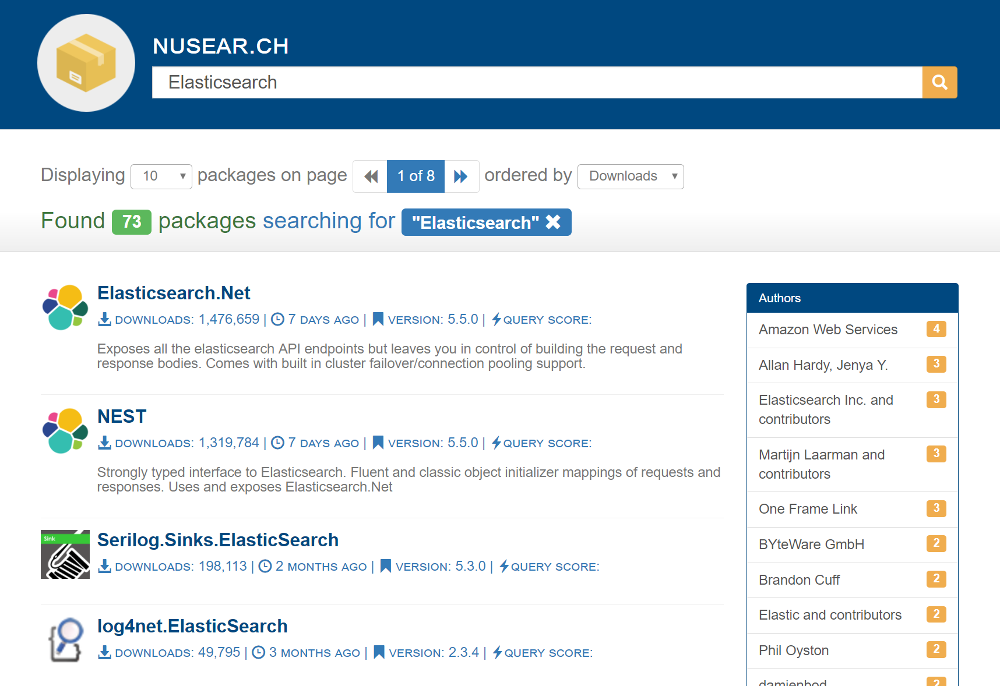

Simply clone the repository and follow the README.md to build out a feature-packed search interface for NuGet packages!

> **NOTE:** If you are reading this on a fork, note that it may be out of sync with: https://github.com/elastic/elasticsearch-net-example

The solution works in:

- [Visual Studio 2017](https://www.visualstudio.com/downloads/)
- [Visual Studio for Mac](https://www.visualstudio.com/vs/visual-studio-mac/)
- [Visual Studio Code](https://code.visualstudio.com/)
- [JetBrains Rider](https://www.jetbrains.com/rider/)

If you find any bugs, please [send us a pull request](https://github.com/elastic/elasticsearch-net-example/pulls), or ask us questions on the [issues page](https://github.com/elastic/elasticsearch-net-example/issues).

# Part 1: Getting started

## Prerequisites

Download and install:

 - [Elasticsearch 5.0 or up - preferably latest](https://www.elastic.co/downloads/). If you are using Windows take advantage of the MSI installer (you won't need to install any plugins).
 
 - [Kibana 5.0](https://www.elastic.co/downloads/kibana).

 - [.NET Core SDK 1.0.4 64-Bit](https://github.com/dotnet/core/blob/master/release-notes/download-archives/1.1.2-download.md) for your platform

 - [Java - preferably latest](http://www.oracle.com/technetwork/java/javase/downloads/jre8-downloads-2133155.html). Ensure `JAVA_HOME` environment variable points to the correct Java directory e.g. `C:\Program Files\Java\jdk1.8.0_131`.

 - [NuGet Feed Data zip](https://nusearch.blob.core.windows.net/dump/nuget-data-jul-2017.zip).
 
 - [Fiddler](https://www.telerik.com/download/fiddler) - to see the requests to and responses from Elasticsearch (optional).
 
Once everything is installed, it's time to:

- [Start Elasticsearch](https://www.elastic.co/guide/en/elasticsearch/reference/current/install-elasticsearch.html)

- [Start Kibana](https://www.elastic.co/guide/en/kibana/current/install.html)
 
## Clone Source

Clone this repository and open the solution using any of

- [Visual Studio 2017](https://www.visualstudio.com/downloads/)
- [Visual Studio for Mac](https://www.visualstudio.com/vs/visual-studio-mac/) 
- [Visual Studio Code](https://code.visualstudio.com/) 
- [JetBrains Rider](https://www.jetbrains.com/rider/)

## Solution structure

The solution consists of 4 projects

```
NuSearch Solution
├─ Nusearch.Domain
│  - Shared domain classes
│  
├─ Nusearch.Harvester
│  - NuGet feed harvester (to download new data - not essential if you [download the NuGet Feed Data zip](https://nusearch.blob.core.windows.net/dump/NuGet-data-dec-2016.zip)).
│  
├─ Nusearch.Indexer
│  - Indexes the NuGet xml files into Elasticsearch
│  
└─ Nusearch.Web
   - The ASP.NET Core web application we'll be building out
```

Open the `src/NuSearch.sln` solution and build to ensure that the solution compiles without error.

# Part 2: Indexing

## Naive Indexing and some NEST basics

### Understanding the indexer

Before we can begin searching over the NuGet data we need to index it into Elasticsearch.

Let's take a look at `NuSearch.Indexer` - this is the console application that will be responsible for reading in the package data from the NuGet xml files and indexing them into Elasticsearch.

In the `Program.cs` file, `Main()` we have the following code:

```csharp
static void Main(string[] args)
{
    Client = NuSearchConfiguration.GetClient();
    string directory = args.Length > 0 && !string.IsNullOrEmpty(args[0]) 
        ? args[0] 
        : NuSearchConfiguration.PackagePath;
    DumpReader = new NugetDumpReader(directory);

    IndexDumps();

    Console.WriteLine("Press any key to continue");
    Console.ReadKey();
}
```

Make sure you change the value assigned to `NuSearchConfiguration.PackagePath` to where you extracted the [NuGet Feed Data zip](https://nusearch.blob.core.windows.net/dump/NuGet-data-dec-2016.zip), or alternatively, pass in the path as a command line argument.

There are a few classes in the `Main()` method worth mentioning:

- `ElasticClient` is the NEST client - responsible for indexing and searching, as well as administrative functions like snapshot/restore, cluster and node stats etc. It is thread-safe, so you can create a singleton instance (recommended) or you can create a new instance for every request. The client interfaces with the Elasticsearch cluster APIs.

- `NuGetDumpReader` is specific to this workshop. It reads each the NuGet Feed Data xml files into a `NuGetDump` C# POCO, which contains a `IEnumerable<FeedPackage>` property called `Dumps`. Each `FeedPackage` is an unmodified representation of a NuGet package directly from the [NuGet API](https://www.nuget.org/api/v2/Packages).

- `NuSearchConfiguration` is also specific to this workshop. It contains all of the configuration for our Elasticsearch cluster. This centralized configuration is useful, since we'll want to use the same settings in various parts of the overall solution.

Let's take a closer look at `NuSearchConfiguration.GetClient()` method:

```csharp
static NuSearchConfiguration()
{
    _connectionSettings = new ConnectionSettings(CreateUri(9200));
}

public static ElasticClient GetClient() => new ElasticClient(_connectionSettings);
```

Here we are returning a new instance of `ElasticClient` that takes a `ConnectionSettings` object with all of the default values.

> **NOTE:** The client is thread-safe, so it can live as a singleton within your application. Most of the internal caches in NEST are bound to the `ConnectionSettings` instance, so at the very least, be sure to re-use instances of that class. If you are using a Dependency Injection (DI) container (AutoFac, Windsor etc.), make sure `ConnectionSettings` is registered as singleton so that instances of `ElasticClient` can share the same instance.

Now that we're familiar with the code in our indexer, let'start indexing data into Elasticsearch.

### Running the indexer

First, we'll take the simplest approach and just iterate over each `FeedPackage` in a NuGet Feed Data xml file and index them individually into an index named `nusearch`.  We can do this by using the `ElasticClient.Index()` method.

Replace the `Console.WriteLine("Done.");` in `IndexDumps()` with the following:

```csharp
static void IndexDumps()
{
    var packages = DumpReader.Dumps.First().NugetPackages;
    
    Console.Write("Indexing documents into Elasticsearch...");

    foreach (var package in packages)
    {
        var result = Client.Index(package);

        if (!result.IsValid)
        {
            Console.WriteLine(result.DebugInformation);
            Console.Read();
            Environment.Exit(1);
        }
    }

    Console.WriteLine("Done.");
}
```

> **NOTE:** We did `.First()` to read only a single file. This is to save us time by not indexing everything, since we will be refining our indexing code later.

The `Index()` method accepts two parameters:

1. The document to index.
2. An optional lambda expression which enables us to further define the index request (more on that later).

`Index()` returns an `IIndexResponse` (assigned to `result`) that holds all of the relevant response information returned by Elasticsearch. All response types in NEST including `IIndexResponse` implement `IResponse`, and `IResponse` contains a boolean `IsValid` property. This property tells us whether or not the request was considered valid for the target endpoint.

`IResponse` also contains an `ApiCall` property which holds all of the details about the request such as:

- The request URL
- The original raw JSON that was sent
- The exception from Elasticsearch if the request failed 
- ...as well as other metrics.

`DebugInformation` contains the state of the request and response, including where it went wrong in the case of errors. The information is built lazily when the property is accessed.

Let's run the indexer application using the following in the terminal (command prompt), within the `NuSearch.Indexer` directory:

```sh
dotnet run
```

<hr />

You should have got an `ArgumentException`:

```
Indexing documents into Elasticsearch...
Unhandled Exception: System.ArgumentException: Index name is null for the given type and no default index is set. Map an index name using ConnectionSettings.MapDefaultTypeIndices(), Conne
ctionSettings.InferMappingFor<TDocument>() or set a default index using ConnectionSettings.DefaultIndex().
   at Nest.IndexNameResolver.ValidateIndexName(String indexName)
   at Nest.IndexNameResolver.Resolve(Type type)
   at Nest.IndexNameResolver.Resolve(IndexName i)
   at Nest.IndexName.GetString(IConnectionConfigurationValues settings)
   at Nest.RouteValues.Resolve(IConnectionSettingsValues settings)
   at Nest.ElasticClient.Nest.IHighLevelToLowLevelDispatcher.Dispatch[TRequest,TQueryString,TResponse](TRequest request, Func`3 responseGenerator, Func`3 dispatch)
   at NuSearch.Indexer.Program.IndexDumps() in C:\Users\russ\source\elasticsearch-net-example\src\NuSearch.Indexer\Program.cs:line 38
   at NuSearch.Indexer.Program.Main(String[] args) in C:\Users\russ\source\elasticsearch-net-example\src\NuSearch.Indexer\Program.cs:line 24
```

_What happened?_ 

We tried to index a document, but the client did not have enough information to infer all of the required parts that make up URI _path_ to a document. 

Both `type` and `id` have a value set but `index` resolved to `NULL`. Why is that?

Notice in our application, we never specified the index. We can specify it in several ways using NEST, but for now let's just set a default index for the entire client in the `ConnectionSettings` class:

```csharp
static NuSearchConfiguration()
{
    _connectionSettings = new ConnectionSettings(CreateUri(9200))
        .DefaultIndex("nusearch"); // Add this.
}
```

If we run the indexer again we should see `Indexing documents into Elasticsearch...`, then after some time a `Done.` message. All of our index requests were successful.

> **NOTE:** Waiting for the `Done.` message can take a while, we'll explain why it's slow and fix it later.

<hr />

We can check the results of indexing using [Kibana Console](https://www.elastic.co/guide/en/kibana/current/console-kibana.html), by executing a simple 'match all' query against our `nusearch` index and inspecting the results  (i.e. the SQL equivalent of `SELECT TOP 10 * FROM nusearch`)

```json
GET /nusearch/_search
{
  "query": {
    "match_all": {}
  }
}
```

You should get back a response similar to the following

```json
{
   "took": 2,
   "timed_out": false,
   "_shards": {
      "total": 5,
      "successful": 5,
      "failed": 0
   },
   "hits": {
      "total": 934,
      "max_score": 1,
      "hits": [
      {
        "_index": "nusearch",
        "_type": "feedpackage",
        "_id": "635200370491429946",
        "_score": 1,
        "_source": {
          "id": "635200370491429946",
          "version": "1.0.0",
          "authors": "bhuvak",
          "created": "2013-11-14T22:44:10.697",
          "dependencies": "",
          "description": "Package description",
          "downloadCount": 126,
          "galleryDetailsUrl": "https://www.nuget.org/packages/635200370491429946/1.0.0",
          "isLatestVersion": false,
          "isAbsoluteLatestVersion": false,
          "isPreRelease": false,
          "lastUpdated": "2015-03-02T12:57:57Z",
          "published": "1900-01-01T00:00:00",
          "packageHash": "xMO6jFY2X6NDhdSKiyZPg5ThiTcJsvu1tEzSokaFydqLaRwZa7mRW8WOKzJn+zJWLJd3Tfm+VyE7iGQXUnVmBw==",
          "packageHashAlgorithm": "SHA512",
          "packageSize": 3908,
          "reportAbuseUrl": "https://www.nuget.org/package/ReportAbuse/635200370491429946/1.0.0",
          "requireLicenseAcceptance": false,
          "tags": " windows8 ",
          "versionDownloadCount": 126,
          "lastEdited": "2013-11-14T22:44:44.063"
        },
      // ... snip for brevity!
    ]
  }
}
```

Looking at the metadata within the `hits.hits` array - `_index` tells us what index the document belongs to, which in this case is `nusearch`, as expected since its our default index. However, we never specified a type and yet `_type` is returned as `feedpackage`.

_How did that happen?_

Since we did not explicitly set a type for the index request, NEST automatically inferred the type `feedpackage` from the C# POCO type name.

Additionally, we did not specify an Id for the document, but notice that `_id` is set to the NuGet package Id.  NEST is smart enough to infer the Id by convention, looking for an `Id` property on the POCO instance.

Let's change the type name here to `package` instead.  We could do this explicitly in the index request itself:

```csharp
var result = Client.Index(package, i => i
    .Type("package") // We could do this...
);
```

This could be useful, but we'd have to remember to always specify the type when Elasticsearch requires it.  Most of the time you just want a specific POCO to map to a specific Elasticsearch type, so let's tell NEST to always use the Elasticsearch type `package` when dealing with a `FeedPackage` by adding it to the `ConnectionSettings`:

```csharp
static NuSearchConfiguration()
{
    _connectionSettings = new ConnectionSettings(CreateUri(9200))
        .DefaultIndex("nusearch")
        .InferMappingFor<FeedPackage>(i => i
            .TypeName("package")
        );
}
```

Let's take this a step further and instead of relying on a default index, let's tell NEST to always route requests to the `nusearch` index when dealing with instances of `FeedPackage`

```csharp
static NuSearchConfiguration()
{
    _connectionSettings = new ConnectionSettings(CreateUri(9200))
        .DefaultIndex("nusearch")
        .InferMappingFor<FeedPackage>(i=>i
            .TypeName("package")
            .IndexName("nusearch") // Add this.
        );
}
```

Now we could re-index our packages using our new settings, but first we'll need to delete the existing index. Let's add the following to our indexing code to delete the `nusearch` index if it already exists:

```csharp
// Add this method.
static void DeleteIndexIfExists()
{
    if (Client.IndexExists("nusearch").Exists)
        Client.DeleteIndex("nusearch");
}

static void Main(string[] args)
{
    Client = NuSearchConfiguration.GetClient();
    string directory = args.Length > 0 && !string.IsNullOrEmpty(args[0]) 
        ? args[0] 
        : NuSearchConfiguration.PackagePath;
    DumpReader = new NugetDumpReader(directory);

    DeleteIndexIfExists(); // Add this too.
    IndexDumps();

    Console.WriteLine("Press any key to continue");
    Console.Read();
}
```

<hr />

Let's re-run the indexer application using the following in the terminal (command prompt), within the `NuSearch.Indexer` directory:

```sh
dotnet run
```

Checking our results in Kibana Console again, our hits metadata should now look like this:

```json
"_index": "nusearch",
"_type": "package",
"_id": "01d60cc9-6e4d-4119-93d3-9634180b8e87",
"_score": 1,
```

### Conclusion

So far you have learned how to index documents one at a time. Next we will look at bulk indexing.

## Bulk indexing

Right now our indexer iterates over the contents of a Nuget Feed Data xml file and indexes each package one at a time.  This means we're making a HTTP request for each item we index. When we have a large number of documents to index, an HTTP request for each one isn't very efficient.

Instead, we're going to use [Elasticsearch's Bulk API](http://www.elastic.co/guide/en/elasticsearch/reference/current/docs-bulk.html) and index multiple documents in a single HTTP request. This will give us much better performance.

Let's change up our indexing code in `IndexDumps()` to use the `Bulk()` method exposed by NEST:

```csharp
static void IndexDumps()
{
    var packages = DumpReader.Dumps.First().NugetPackages;

    Console.Write("Indexing documents into Elasticsearch...");

    // New bulk method.
    var result = Client.Bulk(b =>
    {
        foreach(var package in packages)
            b.Index<FeedPackage>(i => i.Document(package));

        return b;
    });

    if (!result.IsValid)
    {
        Console.WriteLine(result.DebugInformation);
        Console.Read();
        Environment.Exit(1);
    }

    Console.WriteLine("Done.");
}
```

<hr />

Here we are using a multi-line lambda expression within the `Bulk()` method call to iterate over our `packages` collection, passing each package to the bulk `Index()` method.  

> **NOTE:** We have to explicitly state the type of the object we are indexing. Unlike the regular `Client.Index()` method, `Bulk()` can deal with more than one different type in the same request. For example, we could have easily had a `b.Index<Foo>(i => i.Document(myFoo))` in the same foreach loop. In fact, the bulk API supports several operations incuding delete and update in the same bulk call, we could also have a `b.Delete<FeedPackage>(d => d.Id(123))` in our call too.

Let's take a look at the request that `Bulk()` generates in Fiddler. It builds a request that consists of the operation (in our case all `index`) and the document:

```json
...
{ "index" :  {"_index":"nusearch","_type":"package","_id":"NEST"} }
{"id":"NEST","version":"1.4.3.0","authors":"Elasticsearch, Inc." }
{ "index" :  {"_index":"nusearch","_type":"package","_id":"Elasticsearch.Net"} }
{"id":"nest","version":"1.4.3.0","authors":"Elasticsearch, Inc." }
{ "index" :  {"_index":"nusearch","_type":"package","_id":"Newtonsoft.Json"} }
{"id":"Newtonsoft.Json","version":"1.4.3.0","authors":"James K. Newton" }
...
```

The response from the bulk API will be a collection of operation results, each with their own status. For the example above, the response would look something like:

```json
...
"items": [
    {"index":{"_index":"nusearch","_type":"package","_id":"NEST","_version":1,"status":201}},
    {"index":{"_index":"nusearch","_type":"package","_id":"Elasticsearch.NET","_version":1,"status":201}},
    {"index":{"_index":"nusearch","_type":"package","_id":"Newtonsoft.Json","_version":1,"status":201}}
]
...
```

The `201` HTTP `status` against each operation indicates that they all completed successfully (as per [HTTP Status codes](https://en.wikipedia.org/wiki/List_of_HTTP_status_codes)).

> **NOTE:** A single failed operation in the bulk call will *not fail the entire* request. For instance, if the `Newtonsoft.Json` document above failed to index, but the others succeeded, the HTTP status code for the entire request would still be a `200` (HTTP OK), but the corresponding object in the `items` for `Newtonsoft.Json` would indicate a failure through the `status` property (likely to be in the`400` or `500` HTTP status code range).

In NEST the `.IsValid` property will only be true if *all* of the individual operations succeeded, regardless of the actual HTTP status code.

<hr />

Let's go back to our `IndexDumps()` method and revisit the bulk indexing code.

`BulkResponse` exposes an `ItemsWithErrors` collection which will contain any bulk operations that failed. Let's modify `IndexDumps()` again and check the response for errors by adding the following:

```csharp
if (!result.IsValid)
{
    foreach (var item in result.ItemsWithErrors)
        Console.WriteLine("Failed to index document {0}: {1}", item.Id, item.Error);
}
```

Let's go ahead and run our indexer again with:

```sh
dotnet run
```

<hr />

`Done.` should be written in the console - we've just bulk indexed our packages.

## Bulk indexing shortcut

One of the design goals in NEST is to maintain a 1-to-1 mapping with the Elasticsearch API. Only then do we extend the client and expose more convenient ways of accomplishing common uses cases in C#.

Our current bulk indexing code may seem verbose for such a simple operation, however NEST doesn't stop you from being explicit with the bulk API if you so desire. On the other hand, for our case wouldn't it be easier to pass a collection of objects, rather than iterating over each one individually?

You can do just that using the `IndexMany()` method, a NEST client abstraction over the bulk API which takes a collection of objects and expands to our current bulk indexing implementation.

Let's simplify our code using `IndexMany()` instead:

```csharp
static void IndexDumps()
{
    var packages = DumpReader.Dumps.First().NugetPackages;

    Console.Write("Indexing documents into Elasticsearch...");
    
    // Use IndexMany() instead.
    var result = Client.Bulk(b => b.IndexMany(packages));

    if (!result.IsValid)
    {
        foreach (var item in result.ItemsWithErrors)
            Console.WriteLine("Failed to index document {0}: {1}", item.Id, item.Error);

        Console.WriteLine(result.DebugInformation);
        Console.Read();
        Environment.Exit(1);
    }

    Console.WriteLine("Done.");
}
```

### A shortcut to the shortcut

`.Bulk(b => b.IndexMany(packages))` is useful if we want to perform other bulk operations in the same request. However, if we are only interested in indexing, so we can use the `IndexMany()` method on the client instead:

```csharp
static void IndexDumps()
{
    var packages = DumpReader.Dumps.First().NugetPackages;
    Console.Write("Indexing documents into Elasticsearch...");
    
    // Use the shorthand IndexMany()
    var result = Client.IndexMany(packages);

    if (!result.IsValid)
    {
        foreach (var item in result.ItemsWithErrors)
            Console.WriteLine("Failed to index document {0}: {1}", item.Id, item.Error);

        Console.WriteLine(result.DebugInformation);
        Console.Read();
        Environment.Exit(1);
    }

    Console.WriteLine("Done.");
}
```

This is functionally equivalent to our previous approaches, but much more succinct.

### Mappings and document relations

Now that we've bulk indexed our data, let's query for everything by issuing a search request. Open Kibana Console and run `GET /nusearch/_search`.

The results that come back should look similar to:

```json
{
   "took": 4,
   "timed_out": false,
   "_shards": {
      "total": 5,
      "successful": 5,
      "failed": 0
  },
   "hits": {
      "total": 934,
      "max_score": 1,
      "hits": [...]
   }
}
```

*Something strange is going on here. If you've noticed, our dump file contained `5000` documents, but our hits total is only `934`. Where are the missing documents?*

The reason is that our NuGet source data contains multiple versions of the same package (e.g. NEST 1.0, NEST 1.1, etc...) and each version shares the same `Id`. When Elasticsearch encounters an existing `Id` during indexing, it treats it as an update and overwrites the existing document with the new data.

This is probably useful for many use cases, but for ours, we want to be able to search for a specific version of a NuGet package, or at least be able to view them.

To accomplish this, we have to restructure our models and the way we store them in Elasticsearch by creating a more specific mapping.

As mentioned earlier, our current `FeedPackage` C# class is an unmodified representation of a package from the NuGet Feed Data. What we want instead, is a nested structure where we have a single top-level NuGet package that contains the common/shared information and within it, a collection of versions.  We also want to be able to query for a specific version and still return the top-level package. Elasticsearch can deal with complex object graphs, and has a special [nested type](https://www.elastic.co/guide/en/elasticsearch/reference/current/nested.html) specifically for dealing with such relationships.

Before we set this up in Elasticsearch, let's first restructure our `FeedPackage`.

For convenience this has already been done. In our `NuSearch.Domain` project, under the `Model` namespace, we have a few classes already included:

 - `Package.cs`
 - `PackageAuthor.cs`
 - `PackageDependency.cs`
 - `PackageVersion.cs`

These classes are described below:

- `Package` is our top-level representation of a NuGet package and contains all of the common information that is shared across package versions.  Within the `Package` class there is a `PackageVersion` collection, `Versions`, and a `PackageAuthor` collection, `Authors`.

- `PackageVersion` contains all of the version specific data for a given package, and within it a `PackageDependency` collection, `Dependencies`.

- `PackageAuthor` contains a single `Name` property - the publishing author of the package.

- `PackageDependency` contains dependency information for a given package, the assembly name, version, and supported framework.

To use these, we need to change the type name and index name mappings on our `ConnectionSettings` to use the new `Package` type (instead of `FeedPackage`):

```csharp
static NuSearchConfiguration()
{
    _connectionSettings = new ConnectionSettings(CreateUri(9200))
        .InferMappingFor<Package>(i => i
            .TypeName("package")
            .IndexName("nusearch")
        );
}
```

Next, we need to create a mapping in Elasticsearch for our `Package` type in order to treat our version, author, and dependency types as nested types.

Prior to this, we didn't have to create a mapping. In fact, we didn't even have to create the index. We were able to use the *"schema-less"* nature of Elasticsearch by indexing documents and letting it create our `nusearch` index on the fly, inferring the types of our properties from the first indexed document. This is known as a [`dynamic mapping`](https://www.elastic.co/guide/en/elasticsearch/reference/current/dynamic-mapping.html) and is convenient for getting up and running quickly, but almost never suitable for when you would like to search your data in specific ways, like we do in this instance.

Instead of using dynamic mapping, let's setup our mapping at the same time we create our index.

Let's add a `CreateIndex()` to `Program.cs` in `NuSearch.Indexer` with the following implementation:

```csharp
static void CreateIndex()
{
    Client.CreateIndex("nusearch", i => i
        .Settings(s => s
            .NumberOfShards(2)
            .NumberOfReplicas(0)
        )
        .Mappings(m=>m
            .Map<Package>(map => map
                .AutoMap()
                .Properties(ps => ps
                    .Nested<PackageVersion>(n => n
                        .Name(p => p.Versions.First())
                        .AutoMap()
                        .Properties(pps => pps
                            .Nested<PackageDependency>(nn => nn
                                .Name(pv => pv.Dependencies.First())
                                .AutoMap()
                            )
                        )
                    )
                    .Nested<PackageAuthor>(n => n
                        .Name(p => p.Authors.First())
                        .AutoMap()
                        .Properties(props => props
                            .Text(t => t
                                .Name(a => a.Name)
                                .Fielddata()
                            )
                        )
                    )
                )
            )
        )
    );
}
```

Let's break down the `CreateIndex()` call.

First, we're creating an index named `nusearch` with 2 primary shards and no replicas. Prior to this Elasticsearch, by default, created the `nusearch` index with 5 primary shards and 1 replica.

Next, `Mapping()` allows us to define a mapping for our `Package` POCO. We call [`AutoMap()`](https://www.elastic.co/guide/en/elasticsearch/client/net-api/current/auto-map.html) which automatically maps all of the public properties found on the `Package` class. If we had defined an [`ElasticsearchType` attribute](https://www.elastic.co/guide/en/elasticsearch/client/net-api/current/attribute-mapping.html) (something we don't discuss in this workshop) on any of the properties, they would get picked up here.

Instead of using attributes, we are going to define our properties using the `Properties()` fluent interface. This allows us to override the defaults created by `AutoMap()`. Our `PackageVersion` would have been treated as an `object` by default, but instead we want it to be a [nested type](https://www.elastic.co/guide/en/elasticsearch/reference/current/nested.html) so we call `Nested<T>()` with `T` being `PackageVersion`. We then supply a name, and map its properties with another call to `AutoMap()`. This process is also repeated for `PackageDependency` which is nested within `PackageVersion`...two levels of nested objects. Lastly, we map `PackageAuthor`.

`GetPackages()` creates a dictionary of packages keyed by their Id and iterates through each package in the NuGet Feed Data xml file(s).  When it encounters a new package it simply adds it to the dictionary. When it encounters a package that already exists in the dictionary, it adds the package to the `Versions` collection. At the end, it simply returns all of the packages as a single collection of `Package`s. Also, take note that all of the property mapping and parsing between `FeedPackage`, `Package`, and `PackageVersion` takes place in the constructors of `Package` and `PackageVersion`.

We need to make a small change to `NuSearch.Indexer` the `IndexDumps()` method and have it now call `GetPackages()`:

```c#
var packages = DumpReader.GetPackages();
```

Uncomment `GetPackages()` in `NugetDumpReader`.

Also, we don't want to bulk index _all_ of our data in one request - it's nearly 700mb. Instead, we should limit the amount of data in one bulk request. There's another Bulk method in NEST, `BulkAll()`, that is helpful when we need to partition a collection of documents up into smaller collections and make multiple bulk requests. It uses an observable design pattern to:

1. Set up the conditions for the operation that will be observed
2. Subscribe an observer to the operation to observe when:
    1. The next bulk request is issued
    2. If an error occurs within a bulk request
    3. The operation has completed.

Let's wire up `BulkAll()`

```csharp
static void IndexDumps()
{
    Console.WriteLine("Setting up a lazy xml files reader that yields packages...");
    var packages = DumpReader.GetPackages();

    Console.Write("Indexing documents into Elasticsearch...");
    var waitHandle = new CountdownEvent(1);

    var bulkAll = Client.BulkAll(packages, b => b
        .BackOffRetries(2)
        .BackOffTime("30s")
        .RefreshOnCompleted(true)
        .MaxDegreeOfParallelism(4)
        .Size(1000)
    );

    bulkAll.Subscribe(new BulkAllObserver(
        onNext: b => Console.Write("."),
        onError: e => throw e,
        onCompleted: () => waitHandle.Signal()
    ));

    waitHandle.Wait();
    Console.WriteLine("Done.");
}
```

`GetPackages()` still needs to load all the files data into memory before indexing, but in using `BulkAll()`, issuing bulk requests to index all the packages is made much simpler.

In each bulk request, we're indexing 1000 documents using the `.Size(1000)` method, but how do you calculate the number to index in each request? It is going to depend on the overall size of each bulk request (in bytes), the hardware used in the cluster, the configuration of the cluster, complexity of the documents... etc. There are no hard and fast rules for what a good number will be and the only true way of knowing is to benchmark it. For our purposes in this workshop, 1000 documents in each bulk request should be fine.

Finally, let's add a call to `CreateIndex()` before `IndexDumps()`. `Main()` should now look like this:

```csharp
static void Main(string[] args)
{
    Client = NuSearchConfiguration.GetClient();
    var directory = args.Length > 0 && !string.IsNullOrEmpty(args[0] 
        ? args[0] 
        : NuSearchConfiguration.PackagePath;
    DumpReader = new NugetDumpReader(directory);

    DeleteIndexIfExists();
    CreateIndex();
    IndexDumps();

    Console.WriteLine("Press any key to continue");
    Console.Read();
}
```

Let's run our indexer one more time, this time indexing everything. We now should see a lot more more packages in our `hits.total`:

```json
{
  "took": 74,
  "timed_out": false,
  "_shards": {
    "total": 2,
    "successful": 2,
    "failed": 0
  },
  "hits": {
    "total": 40740,
```

Since we are going to run the indexer multiple times in the next section it is worth changing `IndexDumps()` to index only a 1000 packages:

```csharp
var packages = DumpReader.GetPackages().Take(1000);
```

### Aliases

Every time we've made a change to our index that required us to re-index our packages, we had to delete the existing index. That doesn't sound ideal in a production environment. Certainly, deleting an index on a production application should be done with great care.

Elasticsearch has an important feature that can be leveraged to deal with situations like this, called [index aliases](http://www.elastic.co/guide/en/elasticsearch/reference/current/indices-aliases.html).

> The index aliases API allow to alias an index with a name, with all APIs automatically converting the alias name to the actual index name. An alias can also be mapped to more than one index, and when specifying it, the alias will automatically expanded to the aliases indices. An alias can also be associated with a filter that will automatically be applied when searching.

For the folks with a SQL background, you can sort of think of an alias as synonymous with a View.

Instead of pointing directly to the `nusearch` index in our application, we can create an alias that *points* to our index and have our application reference the alias instead.  When we need to re-index data, we can create a brand new index alongside our live one and index our data into that.  When we're done, we can swap the alias to point to our new index *all without having the change the application code*.  The operation of swapping aliases is atomic, so the application will not incur any downtime in the process.

This may be better understood through the following diagram:

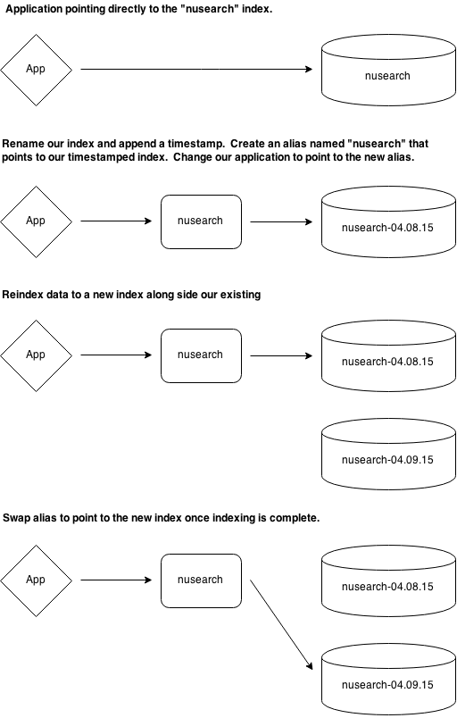

We shall now implement something close to what is shown above.

First let's create a new property to hold our *current* index name in the `NuSearch.Indexer` project on the `Program` class.

```csharp
private static string CurrentIndexName { get; set; }
```

We already have a `CreateIndexName()` method in our `NuSearchConfiguration` class that will create us a `nusearch-` index with the current date and time appended to it.

Lets add the following to the `Main()` method:

```csharp

static void Main(string[] args)
{
    Client = NuSearchConfiguration.GetClient();
    var directory = args.Length > 0 && !string.IsNullOrEmpty(args[0]) 
        ? args[0] 
        : NuSearchConfiguration.PackagePath;
    DumpReader = new NugetDumpReader(directory);
    CurrentIndexName = NuSearchConfiguration.CreateIndexName(); // Add this.

    DeleteIndexIfExists();
    CreateIndex();
    IndexDumps();

    Console.WriteLine("Press any key to exit.");
    Console.ReadKey();
}
```

Next, we're going to introduce 2 aliases: `nusearch`, which will point to our *live* index, and `nusearch-old` which will point to our old indices (or *indexes*).

You can't have an index _and_ an alias with the same name, and we've been using an index named `nusearch` already, so let's delete our `nusearch` index, using `DELETE /nusearch` in Kibana Console.

Let's now add some code in the `NuSearch.Indexer` project on the `Program` class to handle our alias swapping:

```csharp
private static void SwapAlias()
{
    var indexExists = Client.IndexExists(NuSearchConfiguration.LiveIndexAlias).Exists;

    Client.Alias(aliases =>
    {
        if (indexExists)
            aliases.Add(a => a.Alias(NuSearchConfiguration.OldIndexAlias).Index(NuSearchConfiguration.LiveIndexAlias));

        return aliases
            .Remove(a => a.Alias(NuSearchConfiguration.LiveIndexAlias).Index("*"))
            .Add(a => a.Alias(NuSearchConfiguration.LiveIndexAlias).Index(CurrentIndexName));
    });

    var oldIndices = Client.GetIndicesPointingToAlias(NuSearchConfiguration.OldIndexAlias)
        .OrderByDescending(name => name)
        .Skip(2);

    foreach (var oldIndex in oldIndices)
        Client.DeleteIndex(oldIndex);
}
```

We now need to edit `CreateIndex()` to use our new `CurrentIndexName`:

```csharp
Client.CreateIndex(CurrentIndexName, i => i
    // ...
)
```

Lastly, we need to change our bulk call to index into `CurrentIndexName`, otherwise it will infer `nusearch` from our connection settings (and that's now used by our alias):

Add the following to the `BulkAll` call:

```csharp
var bulkAll = Client.BulkAll(packages, b => b
    .Index(CurrentIndexName) // Add this.
    .BackOffRetries(2)
    .BackOffTime("30s")
    .RefreshOnCompleted(true)
    .MaxDegreeOfParallelism(4)
    .Size(1000)
);
```

We can delete the `DeleteIndexIfExists()` method, since we wont need it anymore and add the `SwapAlias()` method call.

Our `Main()` now looks like this:

```csharp
static void Main(string[] args)
{
    Client = NuSearchConfiguration.GetClient();
    string directory = args.Length > 0 && !string.IsNullOrEmpty(args[0]) 
        ? args[0] 
        : NuSearchConfiguration.PackagePath;
    DumpReader = new NugetDumpReader(directory);
    CurrentIndexName = NuSearchConfiguration.CreateIndexName();

    CreateIndex();
    IndexDumps();
    SwapAlias();

    Console.WriteLine("Press Enter to continue");
    Console.Read();
}
```

We can now re-index as many times as we'd like without affecting our live web application.

Run the indexer a couple of times, then run the command `GET /_cat/aliases?v` in Kibana Console and you should see something like:

```
alias        index                        filter routing.index routing.search 
nusearch-old nusearch-25-07-2016-05-58-31 -      -             -              
nusearch     nusearch-25-07-2016-05-58-55 -      -             -              
nusearch-old nusearch-25-07-2016-05-58-12 -      -             -              
```

You should see that the alias swapping keeps a maximum of two older versions and points `nusearch` to the latest.

<hr />

Now lets remove that `.Take(1000)` in `IndexDumps()` and index one last time ready for searching.

# Part 3: Searching

## Web architecture

The solution contains `NuSearch.Web`, a console application that hosts the web site. This approach allows you to focus on building the web site without having to configure IIS, Apache or Nginx, or figure out how to run it on other operating systems.

The web project utilizes [ASP.NET Core](https://docs.microsoft.com/en-us/aspnet/core/) using the [Kestrel](https://docs.microsoft.com/en-us/aspnet/core/fundamentals/servers/kestrel) cross platform web server.

You are free to use whatever architecture in your own application. `NEST 5.x` runs on Desktop CLR and Core CLR and supports the following frameworks and libraries:

- .NET Framework 4.5
- .NET Framework 4.6
- .NET Standard 1.3

No prior knowledge of any of these frameworks is required to follow along with the example.

You can start the web application by navigating to the `NuSearch.Web` directory on the command line and typing:

```sh
dotnet run
```

You can then browse the NuSearch web application locally: [http://localhost:5000](http://localhost:5000) (this may be a different port if there is a conflict, the port number is outputted to the console).

If all is well you should now see the site with 'No results', if you have a problem see the [troubleshooting section](#Troubleshooting).

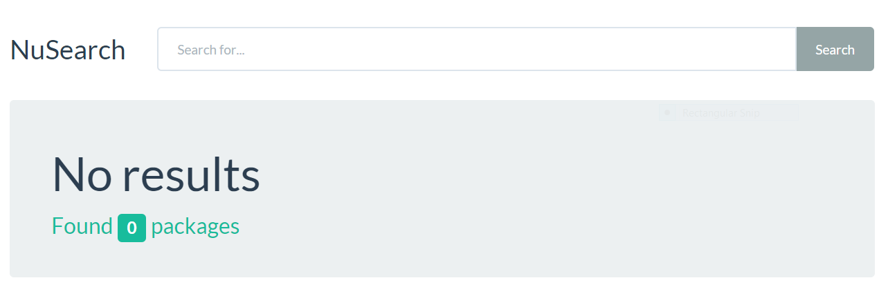

### Getting started

We've already completed the plumbing for the web application with the following structure:

 Folder     | Purpose
------------|-----------
Controllers | MVC controllers to respond to requests
Models      | ViewModels for requests and responses
Views       | Views for response HTML
wwwroot     | Static content such as JavaScript and CSS files. You'll need to uncomment some statements in here as we progress through the workshop.

### The Search Controller

Our search interface is handled by one `action` defined on the `SearchController` class inside the `Controllers` folder:

```csharp
public class SearchController : Controller
{
    private readonly IElasticClient _client;

    public SearchController(IElasticClient client) => _client = client;

    [HttpGet]
    public IActionResult Index(SearchForm form)
    {
        // TODO: You'll write most of the implementation here
        var model = new SearchViewModel();

        return View(model);
    }
}
```

- `SearchForm` contains the form parameters from the user interface.
- `SearchViewModel` is the model used to display the search results.

### Setting up Fiddler

The plumbing of this application automatically uses [Fiddler](https://www.telerik.com/download/fiddler) as a proxy. 

> **NOTE:** Fiddler has to be running before you start `NuSearch.Web`.

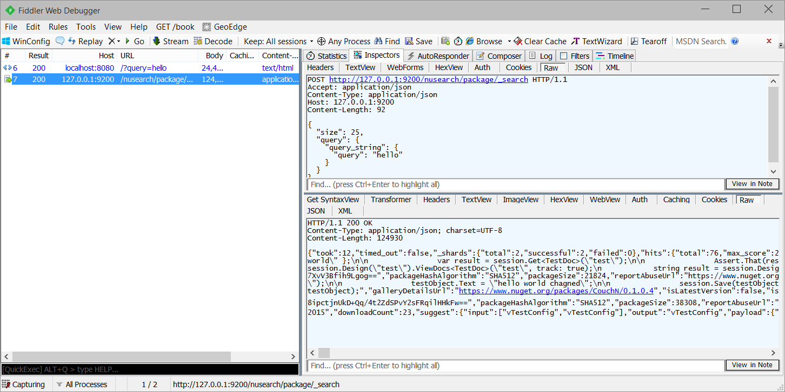

If you want to see pretty responses from Elasticsearch, update `NuSearchConfiguration.cs` and add `.PrettyJson()` to the `ConnectionSettings()`:

```csharp
static NuSearchConfiguration()
{
    _connectionSettings = new ConnectionSettings(CreateUri(9200))
        .InferMappingFor<Package>(i => i
            .TypeName("package")
            .IndexName("nusearch")
        )
        .PrettyJson(); // Add this.
}
```

### Search basics

In order to search we need a NEST client for our controller action. Thankfully, this has already been wired up for us - an instance of `IElasticClient` is passed to the constructor of our controller and assigned to the `_client` field.

We could issue a search request using the `_client` instance.

```csharp
    var result = _client.Search<Package>(s => s);
```

NEST has a fluent lambda expression syntax - i.e. the `s => s` parameter.

*What's going on here?*

This lambda expression receives a `SearchDescriptor<Package>()`
(the `s` parameter) which can be modified to alter the search request issued to Elasticsearch.

The Elasticsearch APIs and corresponding query language is very rich, so instantiating a new request using object initialisation can be cumbersome. Using the fluent syntax makes it easier to write terse and more readable search queries.

This syntax is the preferred way, but **it's not the only way**. You could equally write:

```csharp
    var result = _client.Search<Package>(new SearchRequest());
```

We call this syntax the `Object Initializer Syntax` and it is fully supported throughout the client. In this tutorial however, we will be using the `Fluent API Syntax` exclusively.

### Our first search

Back to our search code:

```csharp
    var result = _client.Search<Package>(s => s);
```

This will perform a `POST` on `/nusearch/package/_search` with the following JSON:

```json
{}
```

The `ISearchResponse<T>` returned is assigned to `result`. Lets set the total count on the ViewModel. We are also going to set the `form` on the ViewModel so we have access to it in the view.

```csharp
var model = new SearchViewModel
{
    Hits = result.Hits,
    Total = result.Total,
    Form = form
};
```

We didn't specify how many documents we wanted to be returned in our search query, so Elasticsearch returned 10 by default. However `result.Total` will actually contain how many documents matched our search, in this case all documents.

`Packages` is commented out in `SearchViewModel.cs` as well as the `UrlFor()` method because at the start of the tutorial we had no `Package`. Uncomment them now.

The completed controller action should now look like:

```csharp
[HttpGet]
public IActionResult Index(SearchForm form)
{
    var result = _client.Search<Package>(s => s);

    var model = new SearchViewModel
    {
        Hits = result.Hits,
        Total = result.Total,
        Form = form
    };

    return View(model);
}
```

If you restart the web application you should see some search results:

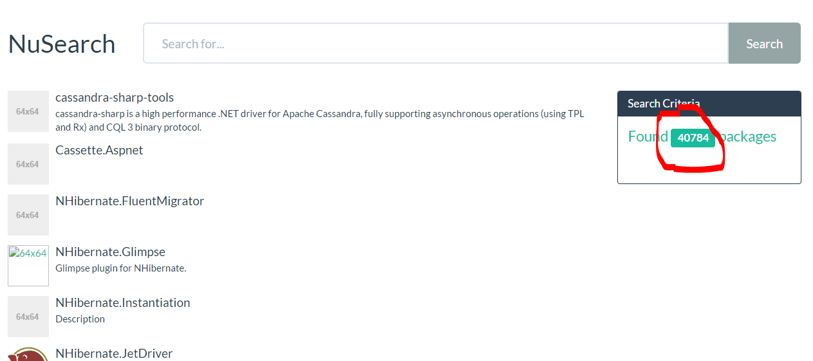

In `Search/Index.cshtml` there are two templates, for when we have and do not have search results:

```csharp
@Html.Partial(Model.Total > 0 ? "Results" : "NoResults", Model)
```

As a final exercise let's explicitly ask for 25 items instead of the default 10 items, modify the search query to the following:

```csharp
    var result = _client.Search<Package>(s => s
        .Size(25)
    );
```

Here we can start to see the `Fluent API Syntax` in action.

### Implementing a search query

At this point, we are doing [`match_all` query](https://www.elastic.co/guide/en/elasticsearch/reference/current/query-dsl-match-all-query.html) and selecting the top 25 results. 

If you type a search, notice how you are submitting a form but instead performing a `POST` this form uses `GET`. This causes the entered query to be part of the url after the `POST`.

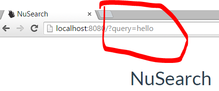

In our `SearchController`, the query string is bound to a `SearchForm` instance by the ASP.NET Core framework and passed to our action method:

```csharp
[HttpGet]
public IActionResult Index(SearchForm form)
{
    // ...
}
```

This means we can use `form.Query` to access what the user typed into the search box, so let's feed that to our search:

```csharp
var result = client.Search<Package>(s => s
    .Size(25)
    // Add this.
    .Query(q => q
        .QueryString(qs => qs
            .Query(form.Query)
        )
    )
);
```

*What's going on here?*

NEST is a one-to-one mapping to the Elasticsearch API, so to do a [`query_string` query](https://www.elastic.co/guide/en/elasticsearch/reference/current/query-dsl-query-string-query.html) in Elasticsearch, you have to send the following JSON:

```json
{
  "query": {
    "query_string": {
      "query": "hello"
    }
  }
}
```

The NEST functions follow the structure of the query JSON. In the cases where a shortcut exists, it's never at the cost of **not** exposing the full Elasticsearch API notation.

### Exploring querying further

Now we have a working search implementation, but how does Elasticsearch know what fields to search? Well by default, when indexing, all of the values from all the fields in the document are aggregated and indexed under the special [`_all`](https://www.elastic.co/guide/en/elasticsearch/reference/current/mapping-all-field.html) field.

If you do not specify a field name explicitly in a search request, the queries will default to using the `_all` field.

Another thing to note about the [`query_string` query](https://www.elastic.co/guide/en/elasticsearch/reference/current/query-dsl-query-string-query.html) we've used is that it exposes the [Lucene query syntax](https://www.elastic.co/guide/en/elasticsearch/reference/current/query-dsl-query-string-query.html#query-string-syntax) to the user.

Try some of the following querie:

* `id:hello*`
* `id:hello* OR id:autofac^1000`

*What's going on here?*

In the first query, we explicitly search for only those `Package`'s with `id`s that start with `hello`. In the second example, we extend this query to also include `autofac`, but boost with a factor of 1000 so that it appears first in the result set.

Do you want to expose this kind of query power to the end user? Consider the following:

* `downloadCount:10`

This will search all the packages with a download count of 10 pretty straight forward.

However, If we search for:

* `downloadCount:X`

...then we get no results. This makes sense, but Elasticsearch is actually throwing an exception in this case.

If you are running Fiddler, you can see this for yourself:

```json
{
  "error" : "SearchPhaseExecutionException[Failed to execute phase [query], ..."
  "status" : 400
}
```

Quite often you don't need to expose this query power to the end user. Elasticsearch has a *better* `query_string` query called [`simple_query_string` query](http://www.elastic.co/guide/en/elasticsearch/reference/master/query-dsl-simple-query-string-query.html) which will never throw an exception when invalid input is encountered and ignores invalid parts.

### The multi_match query

The match query family is very powerful. It will *do the right thing* based on the field it is targetting.

Let's use the [`multi_match` query](https://www.elastic.co/guide/en/elasticsearch/reference/current/query-dsl-multi-match-query.html) to apply our search term(s) to several fields:

```csharp
.Query(q => q
    .MultiMatch(m => m
        .Fields(f => f
            .Fields(
                p => p.Id, 
                p => p.Summary)
            )
        .Query(form.Query)
    )
)
```

Now we are searching `id` and `summary` fields only, instead of the special `_all` field.  Let's look at the results:

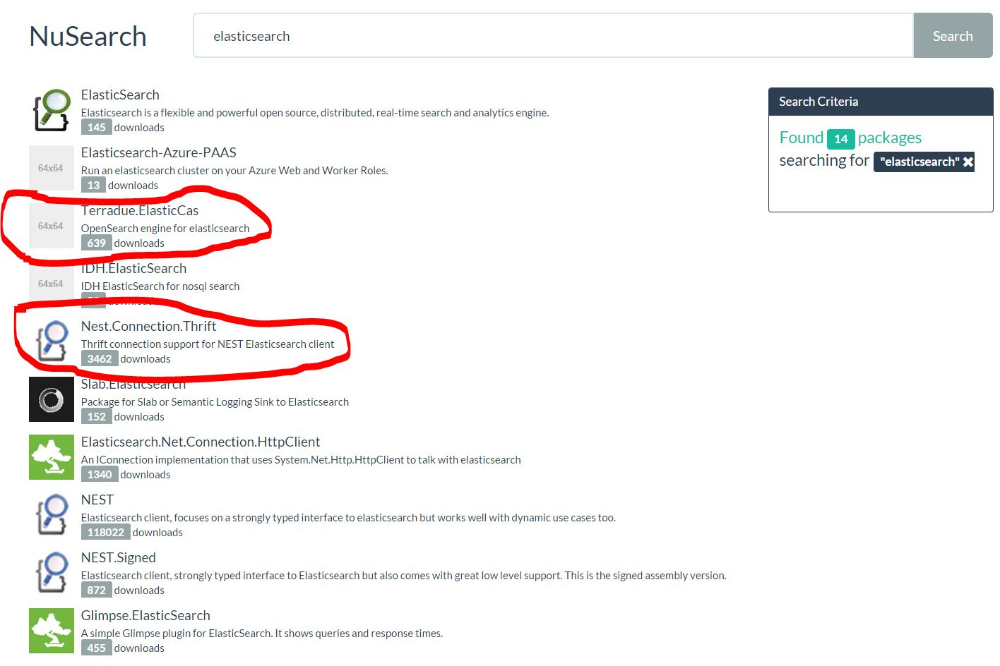

It looks as if matches on `id` are more important then those on `summary`, but as the highlighted result demonstrates, something else is actually going on...

### Relevancy scoring

By default Elasticsearch uses [BM25](https://en.wikipedia.org/wiki/Okapi_BM25) for relevancy scoring of documents. It uses probabilistic methods to determine how well a particular document matches a given query (don't be put off by the mathematical notation).


Prior to Elasticsearch 5.0, [TF/IDF](http://tfidf.com/) was used to score documents for how well they matched a given query, where:

**Term Frequency (TF)**

- **TF(t)** = (Number of times a given term `t` appears in a document) / (Total number of terms in the document).

**Inverse Document Frequency**

- **IDF(t)** = log_e(Total number of documents / Number of documents with term `t` in it).

TF/IDF favours hits on rarer terms in the index, and hits in shorter fields outweigh hits in longer fields.

BM25 is supposed to work better than TF/IDF for short fields, such as those that contain names, and allows finer control over how TF and IDF affect overall relevancy scores. Because of this, it replaced TD/IDF as the default algorithm. 

BM25 degrades the IDF score of a term more rapidly as it appears more frequently within all documents, and can in fact give a negative IDF score for a highly frequent term across documents (although in practice it is often useful to have a lower score bound of 0,).

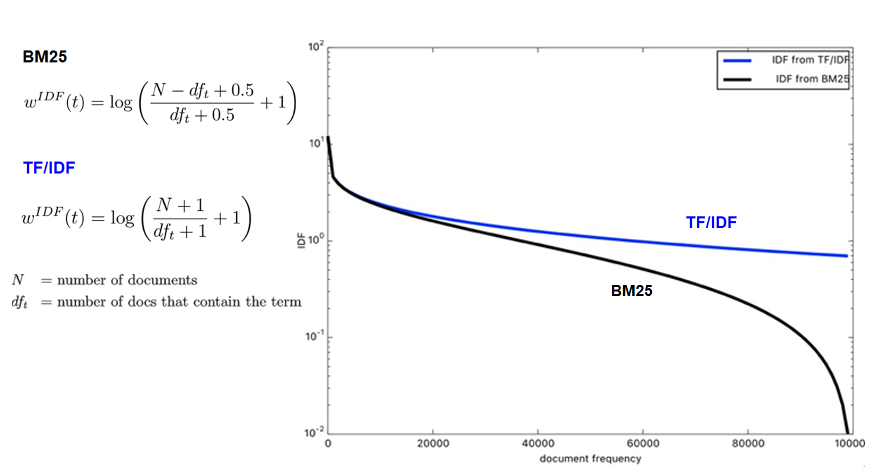

BM25 also limits the influence of the term frequency, using the **k** parameter (referred to as `k1` within the Elasticsearch documentation)

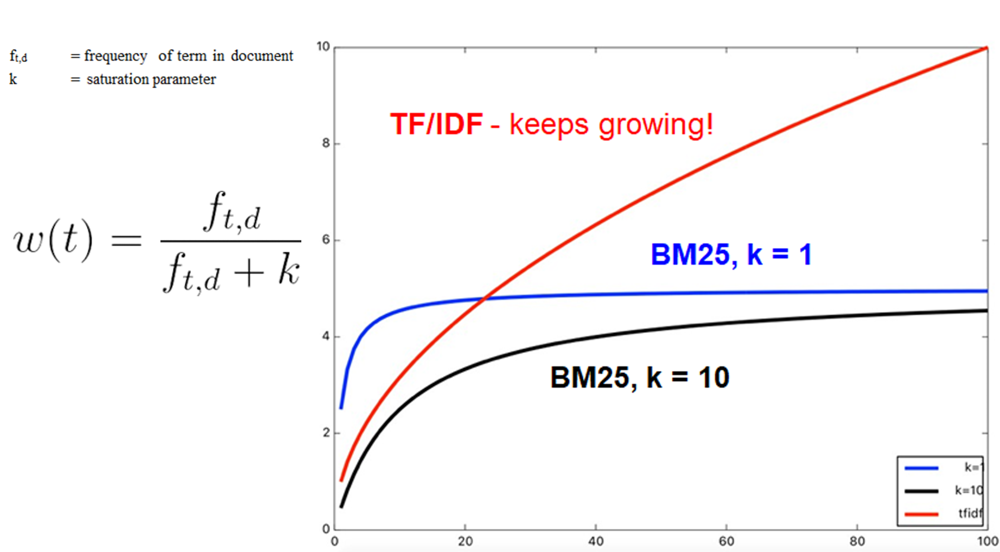

With TF/IDF, the more frequent the term appears within an individual document, the higher the weight score given to that term. With BM25, the `k` parameter can control this influence.

Similarly, BM25 allows finer grain control over the document length than TF/IDF, using the `b` parameter

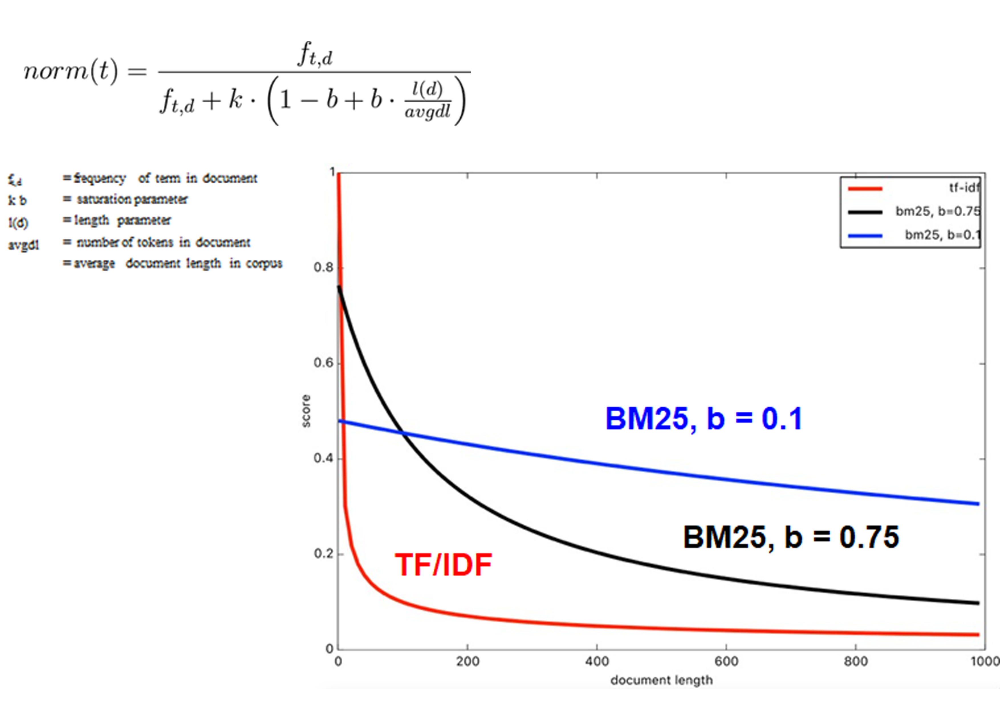

A hit for `elasticsearch` in `id` is usually scored higher then a hit in `summary` since in most cases `id` is a field with less terms overall.

If we had searched `elasticsearch client` the `elasticsearch` keyword would be higher because its IDF is higher than `client` since the entire index contains the term `client` more than it does `elasticsearch`.

This explains why the highlighted packages `Nest.Connection.Thrift` and `Terradue.ElasticCas` score higher than some of the other packages with `elasticsearch` in the id.They have very short `summary` fields. `Nest` and `Nest.Signed` both mention `elasticsearch` in the `summary` and therefore score higher than `Glimpse.Elasticsearch`

> **NOTE:** Relevancy scoring is a complex and well researched problem in the information retrieval space. Our explanation of how Elasticsearch handles relevancy is somewhat simplified, but the Elasticsearch guide has more information around [the theory behind scoring](http://www.elastic.co/guide/en/elasticsearch/guide/master/scoring-theory.html) and how
[Lucene takes a practical approach TD/IDF and the vector space model](http://www.elastic.co/guide/en/elasticsearch/guide/master/scoring-theory.html), even how to [plug in custom similarity scorers](http://www.elastic.co/guide/en/elasticsearch/reference/1.4/index-modules-similarity.html).

### Indexing Analysis

Let's index these two example documents using Kibana Console in a seperate index:

```json
PUT /example_packages/package/1
{
   "id":1,
   "name": "Elasticsearch-Azure-PAAS",
   "author": {
        "name" : "garvincasimir and team",
        "country" : "Unknown"
   }
}
```

```json
PUT /example_packages/package/2
{
   "id":2,
   "name": "Elasticsearch.Net",
   "author": {
        "name" : "Elasticsearch .NET team",
        "country" : "Netherlands"
   }
}
```

Elasticsearch will actually represent these documents within the inverted index as follows:

| field      | terms             | documents
|------------|-------------------|------------
|name        | elasticsearch     | 1
|            | azure             | 1
|            | paas              | 1
|            | elasticsearch.net | 2
|author.name | team              | 1,2
| `....`     | `...`             | `...`

JSON property values are fed through an index analysis chain, extracting the terms from each according to the analysis defined in the chain. Fields can have different analyzers, but out of the box, all string properties use the [standard analyzer](https://www.elastic.co/guide/en/elasticsearch/reference/current/analysis-standard-analyzer.html). The standard analyzer tokenizes the text based on the Unicode Text Segmentation algorithm, as specified in [Unicode Standard Annex #29.](http://unicode.org/reports/tr29/). These extracted terms are referred to as tokens.

The standard analyzer does a decent job as a general analyzer to use for Western languages, however, surprisingly it does not split words joined by a full stop. Furthermore, the standard analyzer lowercases extracted tokens.

The resulting tokens that come out of the index analysis pipeline are stored as `terms` in the inverted index.

You can easily see how the standard analyzer acts on a stream of text by calling the [Analyze API](https://www.elastic.co/guide/en/elasticsearch/reference/current/indices-analyze.html) in Elasticsearch. Enter the following in Kibana Console:

```
GET /_analyze?pretty=true&analyzer=default&text=Elasticsearch.NET
```

returns

```json
{
  "tokens" : [ {
    "token" : "elasticsearch.net",
    "start_offset" : 0,
    "end_offset" : 17,
    "type" : "<ALPHANUM>",
    "position" : 1
  } ]
}
```

...now try:

```
GET /_analyze?pretty=true&text=Elasticsearch-Azure-PAAS
```

returns

```json
{
  "tokens" : [ {
    "token" : "elasticsearch",
    "start_offset" : 0,
    "end_offset" : 13,
    "type" : "<ALPHANUM>",
    "position" : 1
  }, {
    "token" : "azure",
    "start_offset" : 14,
    "end_offset" : 19,
    "type" : "<ALPHANUM>",
    "position" : 2
  }, {
    "token" : "paas",
    "start_offset" : 20,
    "end_offset" : 24,
    "type" : "<ALPHANUM>",
    "position" : 3
  } ]
}
```

We can clearly see now that `Elasticsearch.NET` is **NOT** split into multiple tokens, but `Elasticsearch-Azure-PAAS` is.

### Query analysis

We've now shown how Elasticsearch creates tokens from JSON property values. Another process happens at query time, where some, but **not all** queries, undergo analysis to locate the terms within them. The [`multi_match` query](https://www.elastic.co/guide/en/elasticsearch/reference/current/query-dsl-multi-match-query.html) we are using right now is one of those that analyzes the query it receives.

If we search for `Elasticsearch-Azure-PAAS`, the [standard analyzer](https://www.elastic.co/guide/en/elasticsearch/reference/current/analysis-standard-analyzer.html) will tokenize the text into `elasticsearch`, `azure` and `paas` terms, and find matching documents in its inverted index that contain any of these terms.

The [`match` family of queries](https://www.elastic.co/guide/en/elasticsearch/reference/current/query-dsl-match-query.html) defaults to using an `OR` operator across the terms. Being inclusive or exclusive in your search results is topic with no right answer, although the authors preference is to favour exclusivity. For instance, when I search for `Elasticsearch-Azure-PAAS` I do not want results that only have some of the terms e.g. only `azure` and `paas`, I want documents that contain **all** of `azure` **and** `paas` **and** `elasticsearch`.

Lets update our search query to use `Operator.And`:

```csharp
var result = _client.Search<Package>(s => s
    .Size(25)
    .Query(q => q
        .MultiMatch(m => m
            .Fields(f => f.Fields(p => p.Id, p => p.Summary))
            .Operator(Operator.And)
            .Query(form.Query)
        )
    )
);
```

Now when we search for `Elasticsearch-Azure-SAAS` we only get one result and none of the packages that just contain one of the terms.

### Defining analyzers

*Given your understanding of index and query time analysis, if I ran a `multi_match` on `id` and `summary` using the query `Elasticsearch`, would the following document appear in the search results?*

```json
{
   "id": "Microsoft.Experimental.Azure.ElasticSearch",
   "summary": "This package can deploy Elastic Search on an Azure worker node."
}
```

The answer is no, obviously the `standard` analyzer is not totally sufficient. Quite often the `standard` analyzer works great for regular plain English corpuses but as we've shown, it won't always work for your own data.

Ideally we would want to search on NuGet packages as followed, in order of importance

1. An exact match on `id` should always be the first hit.
2. Better matches of logical parts of the id, broken up by dots and capitalization (e.g we want the `module` out of `ScriptCs.ShebangModule`).
3. Full text search on `summary` and version `description`s.

### The Analysis process

Elasticsearch allows you to build your own analysis chain to find the right terms to represent a body of text


* [Character filters](https://www.elastic.co/guide/en/elasticsearch/reference/current/analysis-charfilters.html) pre-process the text before its handed over to the tokenizer, useful for things like stripping out HTML prior to tokenizing.
* [Tokenizer](https://www.elastic.co/guide/en/elasticsearch/reference/current/analysis-tokenizers.html) an analysis chain can have only 1 tokenizer, which cuts the provided string up in to terms.
* [Token filters](https://www.elastic.co/guide/en/elasticsearch/reference/current/analysis-tokenfilters.html) operate on each individual token and unlike the name might imply, these `filter`s are not just able to remove terms but also replace or inject even more terms.

Let's set up some analysis chains when we create the index. The following is specified as part of the call to `.Settings()` within the `CreateIndex()` method:

```csharp
.Analysis(analysis => analysis
    .Tokenizers(tokenizers => tokenizers
        .Pattern("nuget-id-tokenizer", p => p.Pattern(@"\W+"))
    )
    .TokenFilters(tokenfilters => tokenfilters
        .WordDelimiter("nuget-id-words", w => w
            .SplitOnCaseChange()
            .PreserveOriginal()
            .SplitOnNumerics()
            .GenerateNumberParts(false)
            .GenerateWordParts()
        )
    )
    .Analyzers(analyzers => analyzers
        .Custom("nuget-id-analyzer", c => c
            .Tokenizer("nuget-id-tokenizer")
            .Filters("nuget-id-words", "lowercase")
        )
        .Custom("nuget-id-keyword", c => c
            .Tokenizer("keyword")
            .Filters("lowercase")
        )
    )
);
```
Let's break this down...

```csharp
.Analysis(analysis => analysis
    .Tokenizers(tokenizers => tokenizers
        .Pattern("nuget-id-tokenizer", p => p.Pattern(@"\W+"))
    )
```

Since the default tokenizer does not split `Elasticsearch.Net` into two terms, we'll register a [PatternTokenizer](https://www.elastic.co/guide/en/elasticsearch/reference/current/analysis-pattern-tokenizer.html)
that splits text on any non word character. We name this instance of the `PatternTokenizer` as `nuget-id-tokenizer` so we can refer to it in the analyzer definition:

```csharp
.TokenFilters(tokenfilters => tokenfilters
    .WordDelimiter("nuget-id-words", w => w
        .SplitOnCaseChange()
        .PreserveOriginal()
        .SplitOnNumerics()
        .GenerateNumberParts(false)
        .GenerateWordParts()
    )
)
```

^ Here we set up a [WordDelimiterTokenFilter](https://www.elastic.co/guide/en/elasticsearch/reference/current/analysis-word-delimiter-tokenfilter.html) which will further split terms if they look like two words that are conjoined with [Pascal casing](https://en.wikipedia.org/wiki/PascalCase)

e.g `ShebangModule` will be cut up into `Shebang` and `Module` and because we tell it to preserve the original token, `ShebangModule` is kept as well.

Now that we've registered our custom [Tokenizer](https://www.elastic.co/guide/en/elasticsearch/reference/current/analysis-tokenizers.html) and [TokenFilter](https://www.elastic.co/guide/en/elasticsearch/reference/current/analysis-tokenfilters.html), we can create a custom analyzer that will utilize these:

```csharp
.Analyzers(analyzers => analyzers
    .Custom("nuget-id-analyzer", c => c
        .Tokenizer("nuget-id-tokenizer")
        .Filters("nuget-id-words", "lowercase")
    )
```

^ Here, we create an analyzer named `nuget-id-analyzer` which will split the input using our `nuget-id-tokenizer` and then filter the resulting terms using our `nuget-id-words` filter, finally we use the in-built `lowercase` token filter to replace all the
terms with their lowercase counterparts.

```csharp
    .Custom("nuget-id-keyword", c => c
        .Tokenizer("keyword")
        .Filters("lowercase")
    )
)
```

^ Here we create a special `nuget-id-keyword` analyzer. The built in [Keyword Tokenizer](https://www.elastic.co/guide/en/elasticsearch/reference/current/analysis-keyword-tokenizer.html) emits the provided text as a single term. We
then use the `lowercase` filter to lowercase the `id` as a whole. This will allow us to boost exact matches on `id` higher, without the user having to know the correct casing.

Now that we have registered our custom analyzers, we need to update our mapping so that the `Id` property is configured to use them:

```csharp
.Text(s => s
    .Name(p => p.Id)
    .Analyzer("nuget-id-analyzer")
    .Fields(f => f
        .Text(p => p.Name("keyword").Analyzer("nuget-id-keyword"))
        .Keyword(p => p.Name("raw"))
    )
)
```

Here we setup our `Id` property as a [multi field mapping](https://www.elastic.co/guide/en/elasticsearch/reference/current/multi-fields.html#_multi_fields_with_multiple_analyzers). This allows us to analyze the `Id` property in a number of different ways. It will index the terms from the analysis chain into the inverted index, and allow us to target the different methods in which `Id` property has been analyzed *at search time*.

At index time, `id` will use our `nuget-id-analyzer` to split the NuGet package Id into the proper terms. When we do a `match` query on the `id` field, Elasticsearch will perform analysis on the query input using our `nuget-id-analyzer` to generate the correct terms from the provided input.

When we query `id.keyword` using the `match` query, Elasticsearch will simply use the whole query, lowercase it, and use that as the search term in the `id.keyword` field within the inverted index.

Elasticsearch also creates a field in the inverted index called `id.raw`. This is the raw value which has **not** been analyzed. This field is well suited for sorting and aggregations (some locales sort with case sensitivity).

Now that we have our new mapping in place make sure you re-index so that we can take advantage of our new analyses.

## Updating our search

Since we now have a [multi field mapping](https://www.elastic.co/guide/en/elasticsearch/reference/current/multi-fields.html#_multi_fields_with_multiple_analyzersl) set up for our `Id` property we can differentiate between an exact lowercase match and a match in our analyzed field.
Furthermore, we can make sure a match in our `summary` field has a lower weight in the overall score of our matching document with [boosting at query time](https://www.elastic.co/guide/en/elasticsearch/reference/current/mapping-boost.html)

Updating our `SearchController` now with the updated matching code:

```csharp
var result = _client.Search<Package>(s => s
    .Size(25)
    .Query(q => q
        .MultiMatch(m => m
            .Fields(f => f
                .Field(p => p.Id.Suffix("keyword"), 1.5)
                .Field(p => p.Id, 1.5)
                .Field(p => p.Summary, 0.8)
            )
            .Operator(Operator.And)
            .Query(form.Query)
        )
    )
);
```

> **NOTE:** the `.Suffix("suffix")` notation is a great way to reference the fields defined in a multi field mapping without giving up on strongly-typed references.

If we now search for `elasticsearch`, we'll see all of the packages we missed earlier, including `Microsoft.Experimental.Azure.ElasticSearch`.

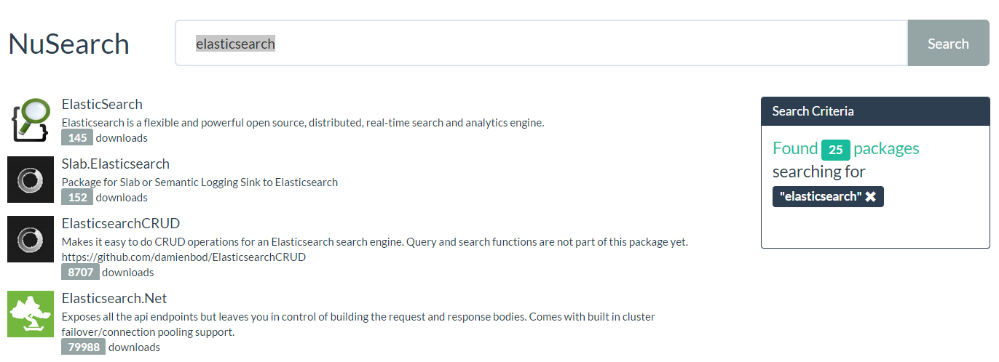

Looking at results however, we see a problem in our querying strategy. The strong boost on `id` pushes down packages with a high number of downloads. For example `NEST` is the official .NET client for Elasticsearch, but since it only mentions Elasticsearch in its summary, it's being penalized by our query and appearing at the bottom of the search results. This is despite it having the most downloads.

This is where the The [`function_score` query](https://www.elastic.co/guide/en/elasticsearch/reference/current/query-dsl-function-score-query.html) comes in:

```csharp
.Query(q => q
    .FunctionScore(fs => fs
        .MaxBoost(50)
        .Functions(ff => ff
            .FieldValueFactor(fvf => fvf
                .Field(p => p.DownloadCount)
                .Factor(0.0001)
            )
        )
        .Query(query => query
            .MultiMatch(m => m
                .Fields(f => f
                    .Field(p => p.Id.Suffix("keyword"), 1.5)
                    .Field(p => p.Id, 1.5)
                    .Field(p => p.Summary, 0.8)
                )
                .Operator(Operator.And)
                .Query(form.Query)
            )
        )
    )
)
```

If you want to influence score beyond BM25 and boosting, using values in the fields of the documents themselves, or by using scripting or random scores then you can use a `function score` query.

Here we use `field_value_factor` with a factor of `0.0001` over each documents `downloadCount` combined with its query score to create an overall relevancy score for each document. This equates to

```
(0.0001 * downloadCount) * score of query
``` 

For packages with a low number of downloads, the actual relevancy score is a major differentatior while still acting as a high signal booster for packages with high download counts. `MaxBoost` caps the boost factor to `50` so that packages of over 500k downloads do not differentiate on downloadCount either.

> **NOTE:** This is a *very* rudimentary `function_score` query, have a [read through the documentation](https://www.elastic.co/guide/en/elasticsearch/reference/current/query-dsl-function-score-query.html) and see if you can come up with something better!

When we now look at our results:

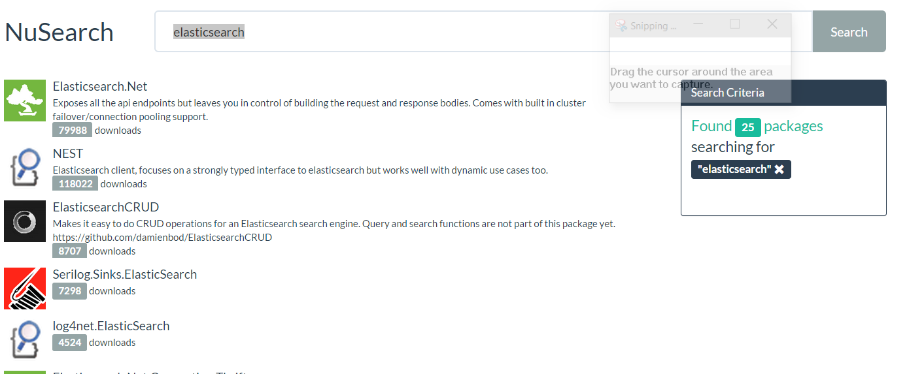

`NEST` and `Elasticsearch.Net` have successfully surfaced to the top of the results. We can also see that this is not simply a sort on download count because `Elasticsearch.Net` is the number one result, despite the fact it has less downloads then `NEST`.

## Combining multiple queries

Elasticsearch exposes [bool queries and filters](https://www.elastic.co/guide/en/elasticsearch/reference/current/query-dsl-bool-query.html), but these do not quite equate to the boolean logic you are used to using in C#. NEST allows you to [use the logical operators `&&` `||` and unary operators `!` and `+`](https://www.elastic.co/guide/en/elasticsearch/client/net-api/current/bool-queries.html) to combine queries into Elasticsearch bool queries. NEST will combine queries in such a way that they follow the exact same boolean logic you are use to in C#.

Having incorporated download count into our search, we've broken exact matches on `Id`, try searching for `antlr4`:

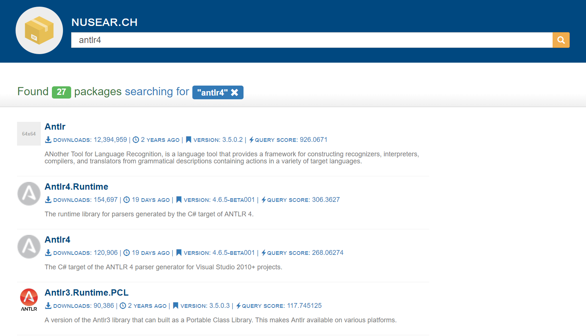

Its not top of the list, lets visit our query again:

```csharp
.Query(q => q
    .Match(m => m
        .Field(p => p.Id.Suffix("keyword"))
        .Boost(1000)
        .Query(form.Query)
    ) || q
    .FunctionScore(fs => fs
        .Functions(ff => ff
            .FieldValueFactor(fvf => fvf
                .Field(p => p.DownloadCount)
    // snip
```

^ Here we use the logical `||` operator to create a bool query to match either on `id.keyword` and if it does, give it a large boost, or otherwise match with our `function_score` query. Note that you can remove the `p.Id.Suffix` field from your `MultiMatch` query's `Fields`, since we'll handle it elsewhere.

Re-running the search, we can see the results:

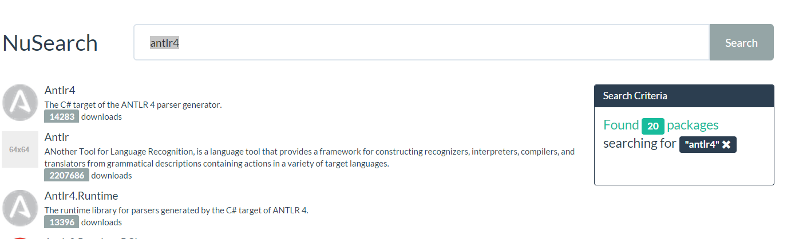

## Conditionless queries

`NEST` has a feature called **conditionless queries** which will rewrite incomplete queries out of the actual query that is sent to Elasticsearch when such a query is considered _conditionless_ by NEST. Given that our query now looks like this:

```csharp
.Query(q => q
    .Match(m => m
        .Field(p => p.Id.Suffix("keyword"))
        .Boost(1000)
        .Query(form.Query)
    ) || q
    .FunctionScore(fs => fs
        .MaxBoost(50)
        .Functions(ff => ff
            .FieldValueFactor(fvf => fvf
                .Field(p => p.DownloadCount)
                .Factor(0.0001)
            )
        )
        .Query(query => query
            .MultiMatch(m => m
                .Fields(f => f
                    .Field(p => p.Id, 1.2)
                    .Field(p => p.Summary, 0.8)
                )
                .Operator(Operator.And)
                .Query(form.Query)
            )
        )
    )
)
```

What happens if `form.Query` is actually `null` or an empty string?

1. The first `match` query on the left side of the `||` operator will mark itself as `conditionless`
2. The `function_score` on the right side of the operator will mark its `query` property as conditionless *but* because it has functions it won't mark itself.
3. The `||` operator implementation notices there is only one resulting query (the `function_score` query) and therefore doesn't wrap it in an unneeded `bool` query.

If you are following along with Fiddler, you can see that in case of an empty `form.Query`, `NEST` will send the following query to Elasticsearch:

```json
{
  "size": 25,
  "query": {
    "function_score": {
      "max_boost": 50,
      "functions": [
        {
          "field_value_factor": {
            "field": "downloadCount",
            "factor": 0.0001
          }
        }
      ]
    }
  }
}
```

If you don't want this _conditionless_ behaviour, you can control that through either `Verbatim`, meaning NEST will send the query as it was specified, empty strings and all, or use `Strict`, which would throw an error if a query was evaluated as _conditionless_.

```csharp
.Query(q => q
    .Match(m => m
        .Field(p => p.Id.Suffix("keyword"))
        .Boost(1000)
        .Query(form.Query)
        .Verbatim(true)
    ) || q
    .FunctionScore(fs => fs
        .Strict()
        // snip
```

If the fluent syntax is not working out for you, this is the equivalent using the object initializer syntax:

```csharp
var result = _client.Search<Package>(new SearchRequest<Package>
{

    Size = 25,
    Query =
        new MatchQuery 
        { 
            Field = Infer.Field<Package>(p => p.Id.Suffix("keyword")), 
            Boost = 1000, 
            Query = form.Query, 
        }
        || new FunctionScoreQuery
        {
            MaxBoost = 50,
            Functions = new List<IScoreFunction>
            {
                new FieldValueFactorFunction
                {
                    Field = Infer.Field<Package>(p=>p.DownloadCount),
                    Factor = 0.0001
                }
            },
            Query = new MultiMatchQuery
            {
                Query = form.Query,
                Operator = Operator.And,
                Fields = Infer.Field<Package>(p => p.Id.Suffix("keyword"), 1.5)
                    .And("id^0.8")
                    .And<Package>(p => p.Summary, 0.8)
            }
        }
});
```

# Part 4: Paging & Sorting

Let's now add pagination and sorting so we can easily browse the search results. Uncomment the following in `Views/Shared/SearchCriteria.cshtml`:

```cshtml
    @* @Html.Partial("ControlHits", Model) *@
```

In `SearchController`, lets update the model with the total number of pages:

```csharp
var model = new SearchViewModel
{
    Packages = result.Documents,
    Total = result.Total,
    Form = form,
    TotalPages = (int)Math.Ceiling(result.Total / (double)form.PageSize)
};
```

Lets also update the search query to incoporate the pagination values passed in from the UI:

```
.From((form.Page - 1) * form.PageSize)
.Size(form.PageSize)
```

We now have a very crude pagination in place, run the web application and check it out.

In order to control the sort order and page size add the following to our search query:

```csharp
.Sort(sort =>
{
    if (form.Sort == SearchSort.Downloads)
        return sort.Descending(p => p.DownloadCount);
    if (form.Sort == SearchSort.Recent)
        return sort.Field(sortField => sortField
            .NestedPath(p => p.Versions)
            .Field(p => p.Versions.First().LastUpdated)
            .Descending()
        );
    return sort.Descending(SortSpecialField.Score);
})
```

1. If the sort order is downloads, we do a descending sort on our `downloadcount` field.
2. If the sort order is most recently updated we need to do a descending `nested sort` on `p.Versions.First().LastUpdated` because we mapped `Versions` as a nested object array in the previous module.
3. Otherwise we sort descending by `"_score"`, which is the default behaviour. Returning `null` here is also an option.

You should now see the following options in the search criteria box:

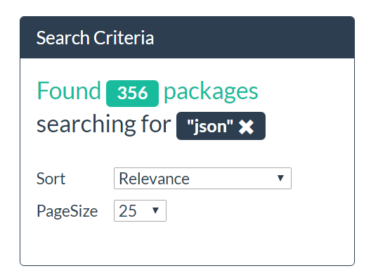

The JavaScript to listen to sort selection changes should already be in place, try it!

# Part 5: Aggregations

Elasticsearch isn't just a search engine it's also an analytics engine. [Aggregations](http://www.elastic.co/guide/en/elasticsearch/reference/current/search-aggregations.html) allow you to analyze your data, build faceted searches, and reap the benefits of the near-real time nature of Elasticsearch.

There are many different aggregations available, each falling into one of four categories

**Bucket aggregations**

> A family of aggregations that build buckets, where each bucket is associated with a key and a document criterion. When the aggregation is executed, all the buckets criteria are evaluated on every document in the context, when a criterion matches the document is considered to "fall in" the relevant bucket. By the end of the aggregation process, we’ll end up with a list of buckets - each one with a set of documents that "belong" to it.

An example of a bucket aggregation is the [terms aggregation](http://www.elastic.co/guide/en/elasticsearch/reference/current/search-aggregations-bucket-terms-aggregation.html) which builds a bucket for each unique term in your index along with the number of times it occurs.  We are going to explore the terms aggregation further in this workshop.

**Metric aggregations**

> Aggregations that keep track and compute metrics over a set of documents.

A few examples of metric aggregations are the [min](http://www.elastic.co/guide/en/elasticsearch/reference/current/search-aggregations-metrics-min-aggregation.html) and [max](http://www.elastic.co/guide/en/elasticsearch/reference/current/search-aggregations-metrics-max-aggregation.html) aggregations, which simply compute, well, the minimum and maximum value of a field.

**Matrix aggregations**

> A family of aggregations that operate on multiple fields and produce a matrix result based on the values extracted from the requested document fields. Unlike metric and bucket aggregations, this aggregation family does not yet support scripting.

**Pipeline aggregations**

> Aggregations that aggregate the output of other aggregations and their associated metrics

## Faceted search

Aggregations make it very easy to build a faceted search interface.  What do we mean by faceted search?  Have you ever visited Amazon and used the navigation on the left-hand side to narrow down your search results?

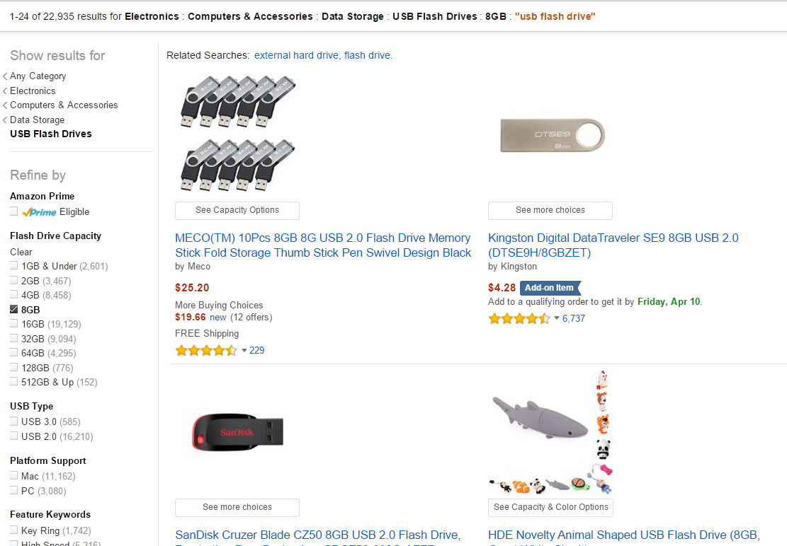

The left hand navigation allows you to narrow down your search results by selecting different criteria, each of which shows the number of results for each selection. This is known as faceted searching, and it's a very useful and intuitive way for a user to navigate through search results.

There are many aggregations that we could use to build out our faceted search, but for the sake of this workshop, we're going to focus on the simple `terms` aggregation. Let's create a `terms` aggregation that will run over our author names and allow our users to filter results by author.

First, let's take a look at the aggregation DSL in Elasticsearch for a `terms` aggregation:

```json
GET nusearch/package/_search
{
  "query": {
    "match_all": {}
  },
  "aggs" : {
    "author-names" : {
      "terms" : { "field" : "authors.name" }
    }
  }
}
```

Aggregations are just another search tool so likes queries, they are executed against the `_search` endpoint.

In our search request, adjacent to the query section, we now have an `aggs` section where we can define any number of aggregations. In this case we define a single `terms` aggregation.

`author-names` is the user-defined name that we are assigning to this particular `terms` aggregation which we will use later to fetch results from the response.

Inside of `author-names` is the Elasticsearch reserved `terms` token that tells Elasticsearch to execute a `terms` aggregation, and inside the `terms` aggregation body we specify the field we want to the aggregation to run over, which in this case is the `authors.name` field.

**Aggregations always execute over the document set that the query returns**. So in this case, our terms aggregation is going to run over **all** the documents in our index since we're doing a `match_all` query (this is sort of a contrived example because we could have left out the query portion altogether in this case). We could have instead, only ran our aggregations over, say, packages that have a download count greater than 1000 by substituting a [`range` query](https://www.elastic.co/guide/en/elasticsearch/reference/current/query-dsl-range-query.html) on our `downloadCount` field rather than a `match_all`.

*There is a problem though, can you guess what it is?*

Remember, our `author` type (`PackageAuthor`) is nested? We need to treat it as a nested object, much like we do in the search queries. So let's change it to:

```json
GET nusearch/package/_search
{
  "query": {
    "match_all": {}
  },
  "aggs": {
    "authors": {
      "nested": {
        "path": "authors"
      },
      "aggs": {
        "author_names": {
          "terms": { "field": "authors.name" }
        }
      }
    }
  }
}
```

Now if we run this in Kibana Console we should get something like:

```json
{
  "took": 61,
  "timed_out": false,
  "_shards": {
    "total": 2,
    "successful": 2,
    "failed": 0
  },
  "hits": {
    "total": 107166,
    "max_score": 1,
    "hits": [...]
  },
  "aggregations": {
    "authors": {
      "doc_count": 107189,
      "author_names": {
        "doc_count_error_upper_bound": 521,
        "sum_other_doc_count": 194830,
        "buckets": [
          {
            "key": "microsoft",
            "doc_count": 4664
          },
          {
            "key": "jason",
            "doc_count": 2474
          },
          {
            "key": "inc",
            "doc_count": 2273
          },
          {
            "key": "jarrett",
            "doc_count": 2250
          },
          {
            "key": "seo",
            "doc_count": 1726
          },
          {
            "key": "software",
            "doc_count": 1640
          },
          {
            "key": "team",
            "doc_count": 1236
          },
          {
            "key": "james",
            "doc_count": 1188
          },
          {
            "key": "contributors",
            "doc_count": 1168
          },
          {
            "key": "ltd",
            "doc_count": 1149
          }
        ]
      }
    }
  }
}
```

Our `match_all` returned hits, but now we have an `aggregations` section of the response that contains the results from our `author_names` `terms` aggregation.  Each bucket has a `key` which is the value of the `authors.name` field along with the corresponding `doc_count` (counted frequency of the term) from all the matching documents.

> **NOTE:** In this example, we returned search hits in addition to aggregation results in a single request.  Many times you only care about retrieving aggregation results from Elasticsearch and don't necessarily care about search results.  In this case it's best to specify `"size" : 0` in the request. This will result in the request executing faster, since Elasticsearch will bypass the document fetching phase.

<hr />

Let's implement the same aggregation in NEST:

In our `SearchController`, let's extend our query and add the `terms` aggregation

```csharp
.Aggregations(a => a
    .Nested("authors", n => n
        .Path(p => p.Authors)
        .Aggregations(aa => aa
            .Terms("author-names", ts => ts
                .Field(p => p.Authors.First().Name)
            )
        )
    )
)
```

This will produce the same JSON request as we ran earlier. Notice how the NEST version looks almost identical to the JSON request.

Let's incoporate these aggregation results into our `SearchViewModel`:

```csharp
var authors = result.Aggs.Nested("authors")
                .Terms("author-names")
                .Buckets
                .ToDictionary(k => k.Key, v => v.DocCount);

var model = new SearchViewModel
{
    Hits = result.Hits,
    Total = result.Total,
    Form = form,
    TotalPages = (int)Math.Ceiling(result.Total / (double)form.PageSize),
    Authors = authors
};
```

There is already a partial view for displaying these results, open up `Views/Shared/Results.cshtml` view and uncomment it:

```csharp
@* @Html.Partial("Aggregations", Model) *@
```

Re-run the web application and you should now have a right-hand navigation that contains the results from our `author-names` aggregation. But wait, something strange is going on with the author names. There's are several lowercased first names, and other generic terms like 'inc' and 'software'. What is going on?

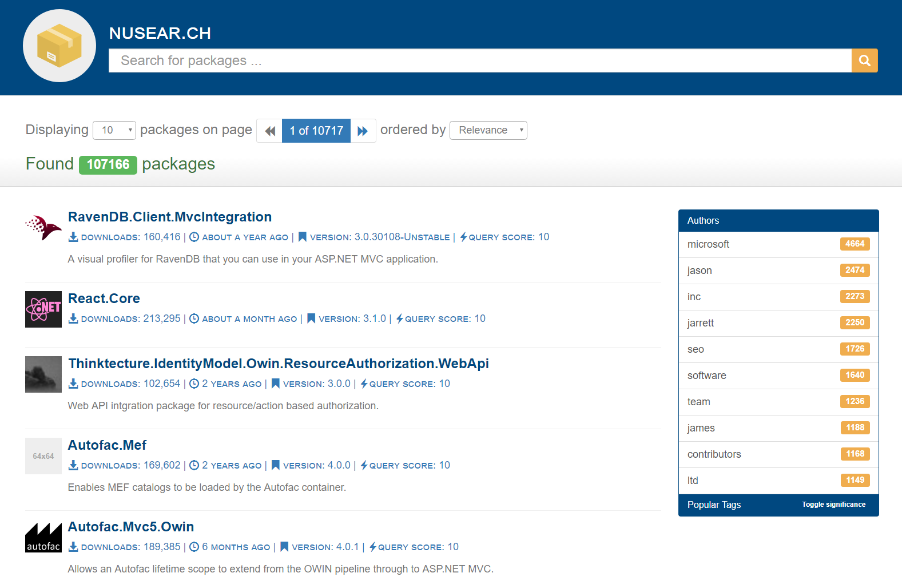

*Can you guess why?*

The author name field is being analyzed with the standard analyzer, meaning an author name like `Elasticsearch, Inc.` is being tokenized and normalized into two separate tokens: `elasticsearch` and `inc`. Instead, we want `Elasticsearch, Inc.` as one single token in our index that we can exactly match on.  We can achieve this by changing our mapping and telling Elasticsearch to not analyze this field, however that will affect our search.  We still want the text `elasticsearch` on the author name field to return results for `Elasticsearch, Inc.`, right?

To solve this, we can introduce a multi_field on `authors.name` and have an analyzed version that we can search on, and a non-analyzed version that we can aggregate on.

Let's change up our mapping of `PackageAuthor` in the `NuSearch.Indexer`:

```csharp
.Nested<PackageAuthor>(n => n
    .Name(p => p.Authors.First())
    .AutoMap()
    .Properties(props => props
        .Text(t => t
            .Name(a => a.Name)
            .Fielddata()
            // Add this.
            .Fields(fs => fs
                .Keyword(ss => ss
                    .Name("raw")
                )
            )
        )
    )
)
```

We define a second field using `Fields()` and name it `raw` as it is a not analyzed version of the field.

Now when we search we can reference the main `authors.name` field, but in our terms aggregation we can reference the newly defined `authors.name.raw` field.

Let's reindex our data once again by navigating to the `NuSearch.Indexer` directory and running the following from the command line

```sh
dotnet run
```

Let's also change the aggregation in the `SearchController` to reference the `raw` field:

```csharp
.Field(p => p.Authors.First().Name.Suffix("raw"))
```

If we run our web application you can see the author names appear exactly how they are defined in the NuGet data.

### Filtering on facet selections

We can add the author facet selection to our query as follows:

```csharp
.Query(q => (q
    .Match(m => m
        .Field(p => p.Id.Suffix("keyword"))
        .Boost(1000)
        .Query(form.Query)
    ) || q
    .FunctionScore(fs => fs
        .MaxBoost(50)
        .Functions(ff => ff
            .FieldValueFactor(fvf => fvf
                .Field(p => p.DownloadCount)
                .Factor(0.0001)
            )
        )
        .Query(query => query
                .MultiMatch(m => m
                .Fields(f => f
                    .Field(p => p.Id, 1.5)
                    .Field(p => p.Summary, 0.8)
                )
                .Operator(Operator.And)
                .Query(form.Query)
            )
        )
    ))
    && +q.Nested(n => n
        .Path(p => p.Authors)
        .Query(nq => +nq
            .Term(p => p.Authors.First().Name.Suffix("raw"), form.Author)
        )
    )
)
```

The query is now evaluated as:

---

- _exact_ term match on `id.keyword`, boosted with 1000 

*OR*

- `function_score` query on our selected fields 

*AND*

- `nested` search on `authors.name.raw` field

---

The `+` before `q.Nested` automatically wraps the query in a `bool query filter` clause, so as not to calculate a score for the query. Similarly, the `!` operator can be used to easily negate a query.

That's all we'll cover on aggregations in this workshop, but we've only scratched the surface.  We encourage you to [read the official documentation on aggregations](https://www.elastic.co/guide/en/elasticsearch/reference/current/search-aggregations.html) and experiment to see what you can come up with.

# Part 6: Suggestions

What's an awesome search experience without autocompletion?

As a final touch to NuSearch, we're now going to add some auto completion functionality to our search box.

Elasticsearch provides a few APIs for suggestions:

- [Term suggester](http://www.elastic.co/guide/en/elasticsearch/reference/current/search-suggesters-term.html) which is handy for providing suggestions for single terms (think spell correction, or "did you mean?" functionality),
 
- [Phrase suggester](http://www.elastic.co/guide/en/elasticsearch/reference/current/search-suggesters-phrase.html) which is similar to the term suggester except works on entire phrases of text rather than individual terms, and 
 
- [Completion suggester](http://www.elastic.co/guide/en/elasticsearch/reference/current/search-suggesters-completion.html) for basic autocomplete functionality.

We're going to focus on implementing autocompletion using the completion suggester.

A question you might ask yourself is, if Elasticsearch provides queries like the [prefix query](http://www.elastic.co/guide/en/elasticsearch/reference/current/query-dsl-prefix-query.html), then why do I need to go to the trouble of using a dedicated suggestion API? The reason is simply for **performance**. The completion suggester is backed by a data structure called an FST ([Finite State Transducer](https://en.wikipedia.org/wiki/Finite-state_transducer)), built at **indexing** time, that can return suggestions in sub-milliseconds; exactly what you want when building out a fast autocompletion or typeahead search suggestion.

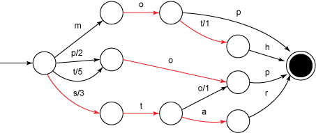

## Setting up the mapping

The completion suggester requires a bit of setup.

The first thing we need to do is introduce a special `completion` field to our existing mapping for the `package` type.  This field needs to contain a couple of things:

1. A list of inputs that we want to suggest on.
2. An optional weight/boost to apply to the suggestion. This will become a bit clearer once we actually get to implementing it.

Add the following property to our `Package` POCO:

```csharp
public CompletionField Suggest { get; set; }
```

Next, we need to map our `Suggest` field as a `completion` type, let's add the following to our existing mapping:

```csharp
.Completion(c => c
    .Name(p => p.Suggest)
)
```

## Indexing suggestions

Now that we have our completion field and mapping setup, we need to actually supply Elasticsearch with the data for our suggestions in order for it to build up the FST at index time.

Let's think about the `input` for our suggestions first. Consider the package `Newtonsoft.Json`.  We'd like to suggest `Newtonsoft.Json` if a user starts typing the beginning characters: `newt`.

Now, `Newtonsoft.Json` being such a popular .NET library, wouldn't it also be useful to also suggest this package if a user simply typed `json` only?

If you take a look at a lot of the NuGet package names/ids, you'll notice that many of them are dot-delimited, so perhaps it makes sense to split on dots and provide each term as an input.

So in that case we'd have:

**Input**: `Newtonsoft`, `Json`

If a user starts typing any of those input terms, we are going to suggest the name of that NuGet package. Make sense so far?

Now imagine there's a very unpopular package out there named `Unpopular.Json.Library`. It too will have the input term `json`.  However, it wouldn't be very useful to suggest this package since it's not likely what the user is looking for.  So, how can we prevent `Unpopular.Json.Library` from being suggested before `Newtonsoft.Json`?

We can use the `Weight` property of the `CompletionField` as a way to boost more popular packages in our suggestions.  The higher the weight, the higher it's boosted.

The next question is how do we determine the popularity of a package?  Well, remember we have the download count? I think that's a pretty good indicator of popularity, so let's use that for our weight value.

Now that we have a plan in place for building our completion fields, let's put it to action by modifying the constructor of our `Package` class and adding:

```csharp
this.Suggest = new CompletionField
{
    Input = new List<string>(latestVersion.Id.Split('.')) { latestVersion.Id },
    Weight = latestVersion.DownloadCount
};
```

Now that we have all the plumbing in place for our completion suggestions, let's re-index.

Once indexing is complete, we can test our suggestions by using Kibana Console by using suggest on the `_search` endpoint. We use [source filtering](https://www.elastic.co/guide/en/elasticsearch/reference/current/search-request-source-filtering.html) to include only the fields we are interested in from the package source, in this case, `id`, `downloadCount` and `summary`

```json
GET nusearch/package/_search
{
  "suggest": {
    "package-suggestions": {
      "prefix": "newt",
      "completion": {
        "field": "suggest"
      }
    }
  },
  "_source": {
    "includes": [
      "id",
      "downloadCount",
      "summary"
    ]
  }
}
```

You should get back a response similar to:

```json
{
  "took" : 5,
  "timed_out" : false,
  "_shards" : {
    "total" : 2,
    "successful" : 2,
    "failed" : 0
  },
  "hits" : {
    "total" : 0,
    "max_score" : 0.0,
    "hits" : [ ]
  },
  "suggest" : {
    "package-suggestions" : [
      {
        "text" : "newt",
        "offset" : 0,
        "length" : 4,
        "options" : [
          {
            "text" : "Newtonsoft",
            "_index" : "nusearch-26-10-2016-23-36-19",
            "_type" : "package",
            "_id" : "Newtonsoft.Json",
            "_score" : 1.2430751E7,
            "_source" : {
              "summary" : "Json.NET is a popular high-performance JSON framework for .NET",
              "id" : "Newtonsoft.Json",
              "downloadCount" : 12430751
            }
          },
          {
            "text" : "Newtonsoft",
            "_index" : "nusearch-26-10-2016-23-36-19",
            "_type" : "package",
            "_id" : "Newtonsoft.Json.Glimpse",
            "_score" : 10706.0,
            "_source" : {
              "id" : "Newtonsoft.Json.Glimpse",
              "downloadCount" : 10706
            }
          },
          {
            "text" : "NewtonsoftJson",
            "_index" : "nusearch-26-10-2016-23-36-19",
            "_type" : "package",
            "_id" : "Rebus.NewtonsoftJson",
            "_score" : 5787.0,
            "_source" : {
              "id" : "Rebus.NewtonsoftJson",
              "downloadCount" : 5787
            }
          },
          {
            "text" : "Newtonsoft",
            "_index" : "nusearch-26-10-2016-23-36-19",
            "_type" : "package",
            "_id" : "Newtonsoft.JsonResult",
            "_score" : 4266.0,
            "_source" : {
              "id" : "Newtonsoft.JsonResult",
              "downloadCount" : 4266
            }
          },
          {
            "text" : "Newtonsoft",
            "_index" : "nusearch-26-10-2016-23-36-19",
            "_type" : "package",
            "_id" : "Newtonsoft.Msgpack",
            "_score" : 1649.0,
            "_source" : {
              "id" : "Newtonsoft.Msgpack",
              "downloadCount" : 1649
            }
          }
        ]
      }
    ]
  }
}

```

## Tying to the web app

So we have our suggestions all setup in Elasticsearch, let's bring them to life in the UI.

We're going to use Twitter's awesome [typeahead.js](https://twitter.github.io/typeahead.js/) library on our search box.  For the sake of time, we've actually gone ahead and implemented it for you already. We just need to un-comment the following line in `NuSearch.Web/wwwroot/js/search.js`:

```javascript
// setupTypeAhead();
```

The implementation of `setupTypeAhead()` does an AJAX post to `/suggest`, we now need to implement that endpoint.

Let's add a new controller in `Controllers` directory called `SuggestController`

```csharp
using System.Linq;
using Microsoft.AspNetCore.Mvc;
using Nest;
using NuSearch.Domain.Model;
using NuSearch.Web.Models;

namespace NuSearch.Web.Controllers
{
    public class SuggestController : Controller
    {
        private readonly IElasticClient _client;

        public SuggestController(IElasticClient client) => _client = client;

        [HttpPost]
        public IActionResult Index([FromBody]SearchForm form)
        {
            // TODO: implement (see below)
        }
    }
}
```

Next, let's use NEST to actually call the suggest on the `_search` endpoint in Elasticsearch:

```csharp
[HttpPost]
public IActionResult Index([FromBody]SearchForm form)
{
    var result = _client.Search<Package>(s => s
        .Index<Package>()
        .Source(sf => sf
            .Includes(f => f
                .Field(ff => ff.Id)
                .Field(ff => ff.DownloadCount)
                .Field(ff => ff.Summary)
            )
        )
        .Suggest(su => su
            .Completion("package-suggestions", c => c
                .Prefix(form.Query)
                .Field(p => p.Suggest)
            )
        )
    );

    var suggestions = result.Suggest["package-suggestions"]
        .FirstOrDefault()
        .Options
        .Select(suggest => new
        {
            id = suggest.Source.Id,
            downloadCount = suggest.Source.DownloadCount,
            summary = !string.IsNullOrEmpty(suggest.Source.Summary)
                ? string.Concat(suggest.Source.Summary.Take(200))
                : string.Empty
        });

    return Json(suggestions);
}
```

We're calling `Suggest()` inside of `Search<Package>()` which maps to Elasticsearch's suggest on the `_search` API endpoint. We then specify the index for where our suggestions live (in this case inferring it from our `Package` type), calling `Completion()` to indicate we're executing a completion suggestion, and in which we further describe by specifying the input text from the user, `.Prefix(form.Query)`, and the path to our suggestion field, `.Field(p => p.Suggest)`.

Notice we've assigned the name `package-suggestions` when we made the request, so we'll use that name to retrieve it from the response.  Lastly, we return an array of objects projected from the source in the result and return this as JSON to our `typeahead` control.

Let's test this out by typing in our search text box:

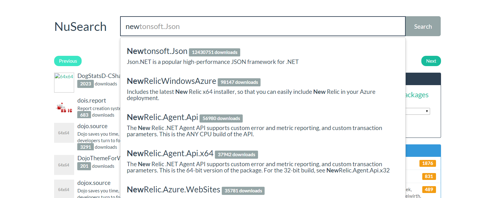

Notice how fast the suggestions are returned.

## Troubleshooting

### Missing NuGet package dependencies

All NuGet package dependencies required for the solution are checked into the repository in the `packages` directory in the root, to make the getting started experience as smooth as possible. That said, if you find there are packages missing, run the following in the terminal, in the `src` directory

```sh
dotnet restore
```

to restore any missing packages.

### Package Elasticsearch.Net 5.5.0 is not compatible with netcoreapp1.1 (.NETCoreApp,Version=v1.1)

This is due to a bug in the .NET Core tooling when restoring packages. To fix this

1. Delete all the directories under `packages`
2. Delete all the `bin` and `obj` directories in
	- `src/NuSearch.Domain`
	- `src/NuSearch.Indexer`
	- `src/NuSearch.Harvester`
	- `src/NuSearch.Web`
3. run the following in the terminal, in the `src` directory

    ```sh
	dotnet restore
	```

### Runtime exception with ASP.NET Core

You may see the following exception when running ASP.NET Core and visting the site on `http://localhost:5000`

```
$ dotnet run
Hosting environment: Production
Content root path: <path to ASP.NET Core directory>
Now listening on: http://localhost:5000
Application started. Press Ctrl+C to shut down.
fail: Microsoft.AspNetCore.Server.Kestrel[13]
      Connection id "0HL6EIBRB75A1": An unhandled exception was thrown by the application.
System.InvalidOperationException: Can not find compilation library location for package 'elasticsearch.net'
   at Microsoft.Extensions.DependencyModel.CompilationLibrary.ResolveReferencePaths()
   at System.Linq.Enumerable.<SelectManyIterator>d__159`2.MoveNext()
   at Microsoft.AspNetCore.Mvc.Razor.Compilation.MetadataReferenceFeatureProvider.PopulateFeature(IEnumerable`1 parts, MetadataReferenceFeature feature)
   at Microsoft.AspNetCore.Mvc.ApplicationParts.ApplicationPartManager.PopulateFeature[TFeature](TFeature feature)
   at Microsoft.AspNetCore.Mvc.Razor.Internal.RazorReferenceManager.GetCompilationReferences()
   at System.Threading.LazyInitializer.EnsureInitializedCore[T](T& target, Boolean& initialized, Object& syncLock, Func`1 valueFactory)
   at Microsoft.AspNetCore.Mvc.Razor.Internal.RazorReferenceManager.get_CompilationReferences()
   at Microsoft.AspNetCore.Mvc.Razor.Internal.DefaultRoslynCompilationService.CreateCompilation(String compilationContent, String assemblyName)
   at Microsoft.AspNetCore.Mvc.Razor.Internal.DefaultRoslynCompilationService.Compile(RelativeFileInfo fileInfo, String compilationContent)
   at Microsoft.AspNetCore.Mvc.Razor.Internal.CompilerCache.CreateCacheEntry(String relativePath, String normalizedPath, Func`2 compile)
--- End of stack trace from previous location where exception was thrown ---
```

Due to a [bug in the .NET Core runtime in some distributions](https://github.com/dotnet/cli/issues/3781), the runtime tries to load assemblies _only_ from the global NuGet cache rather than from the local NuGet `packages` directory. To resolve, either

- copy the directories in the `packages` directory into the global NuGet cache directory. You can find the location of the global NuGet cache directory with 

    ```sh
	dotnet nuget locals global-packages -l
	```

or

- remove the `NuGet.config` file from the root of the repository and run

    ```sh
    dotnet restore
    ```

    from the `src` directory to restore packages into the global NuGet cache.
